# Cicada — Hack The Box

| Attribute | Details |
|---|---|
| Difficulty | Easy |
| OS | Windows |
| Status | Retired |
| Focus | SMB enumeration, credential exposure, password spraying, WinRM, SeBackupPrivilege |

## Overview

Cicada demonstrates a Windows Active Directory compromise driven primarily by
poor credential management and excessive exposure of sensitive information.
Anonymous SMB access reveals an onboarding password, while domain user
enumeration provides valid usernames for controlled password spraying.
Additional credentials are exposed through an Active Directory user description
and a PowerShell script stored on a network share. The final user possesses
`SeBackupPrivilege`, allowing the SAM and SYSTEM registry hives to be copied
and the local Administrator NTLM hash to be recovered.

## Attack Path

`Anonymous SMB → Onboarding Password → User Enumeration → Password Spray → Credential Exposure → DEV Share → WinRM → SeBackupPrivilege → Administrator`

## Reconnaissance
- Nmap scan shows Windows device and standard Active Directory ports
- SMB is open, this will be our first point of Enumeration
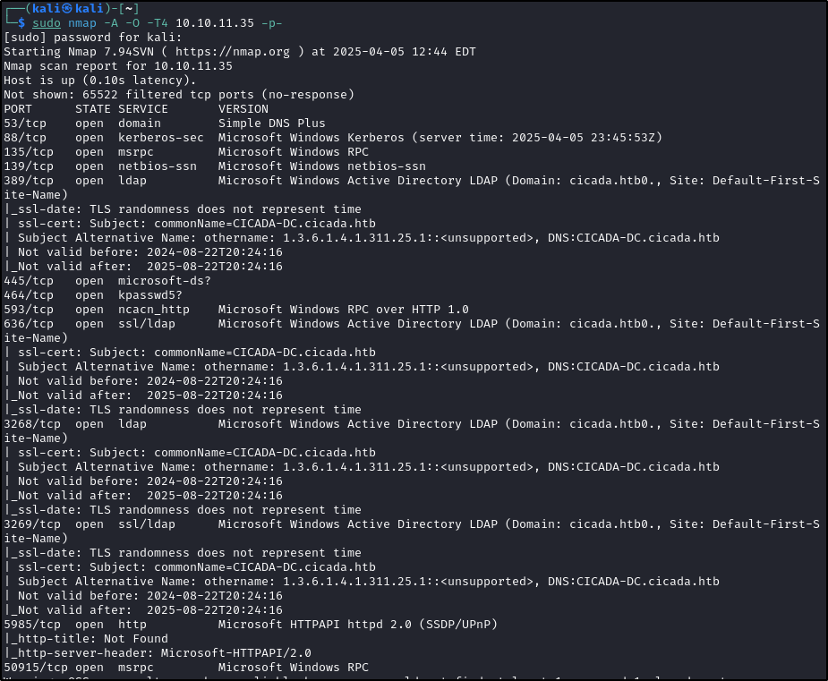

## Enumeration
- Accessing SMB using smbclient and anonymous auth allows access
- File located under HR folder
 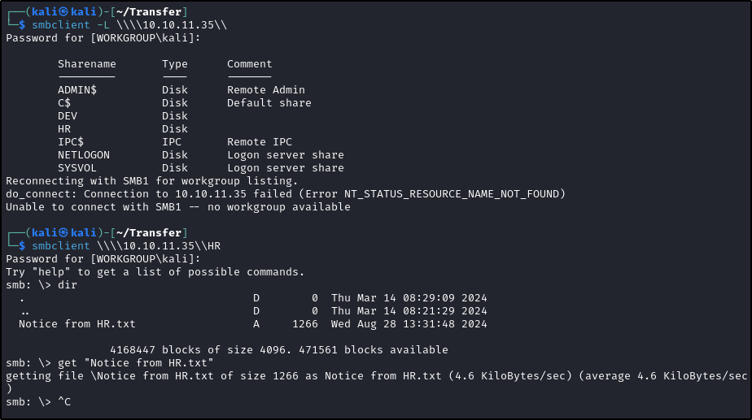
- Reading the contents provides a potential password
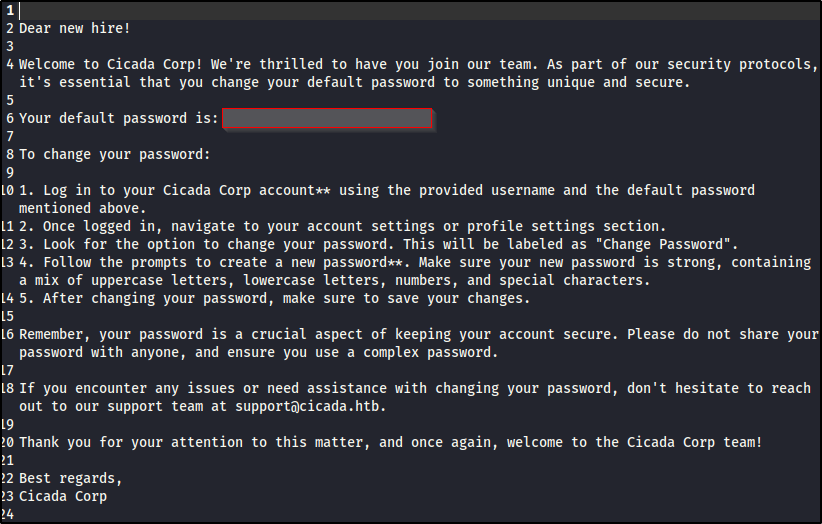
## Initial Foothold
- First a list of potential users is created
- Using Impacket's tool "lookupsid" and guest authentication we are able to create a user list
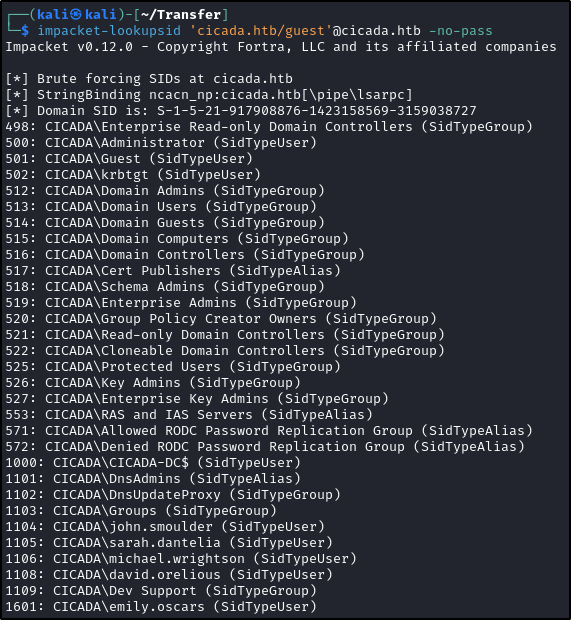
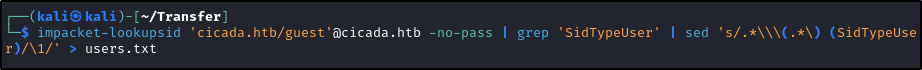
- Using the userlist we created and NetExec to spray for potential users and locating michael.wrightson with the leaked credential
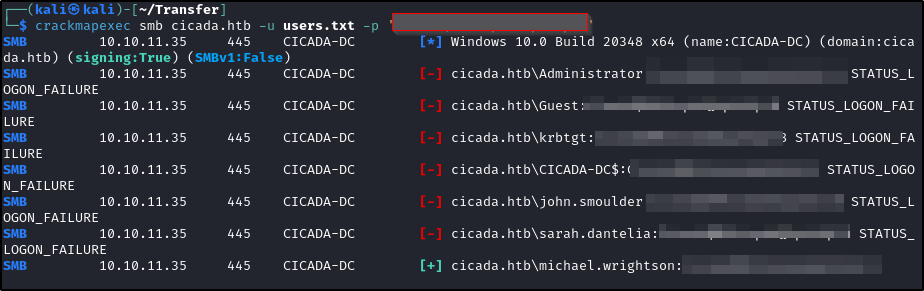
- Using this new user to further enumerate the users confirms password located in description field
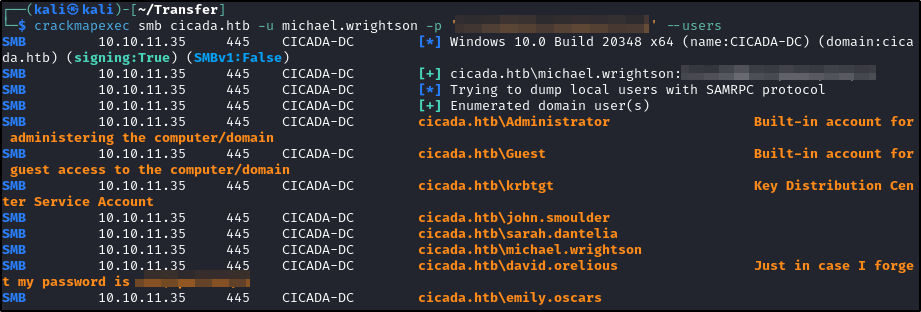
- Checking this users access confirms they can read the Dev share
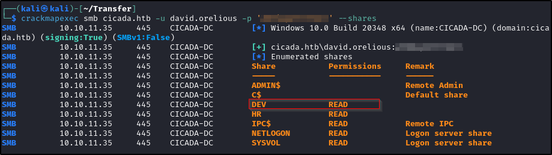
- Accessing Dev as david user and locating a Powershell script
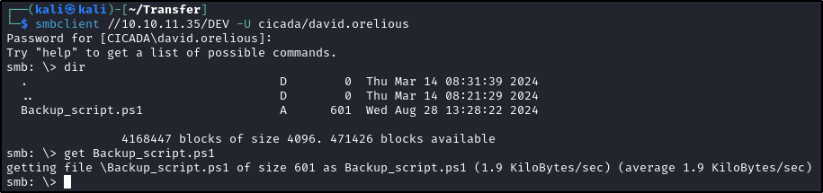
- Reading the script exposed plain text credentials for emily.oscars
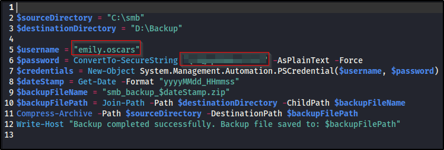
- Confirmed this user has Remote Management access
- Using Evil-Winrm to gain shell access
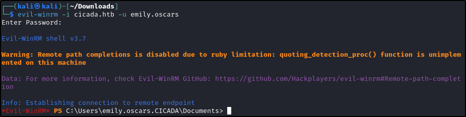

## Privilege Escalation
- Once initial access was gained, user enumeration shows SeBackupPrivilege is enabled
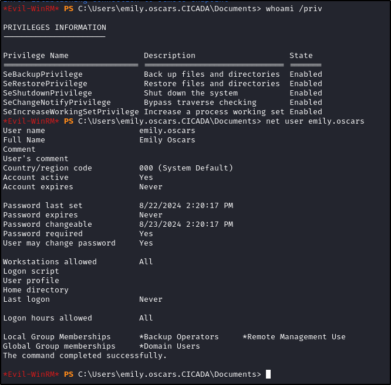
- This privilege allows users to perform backup operations, including registry backups of SAM/SECURITY/SYSTEM
- Running the backup commands and exporting them
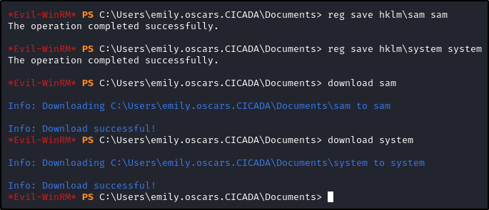
- using Impacket's secretsdump tool to get hash of the administrator
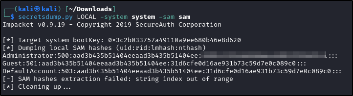
- Testing with Evil-winrm confirms access and root flag
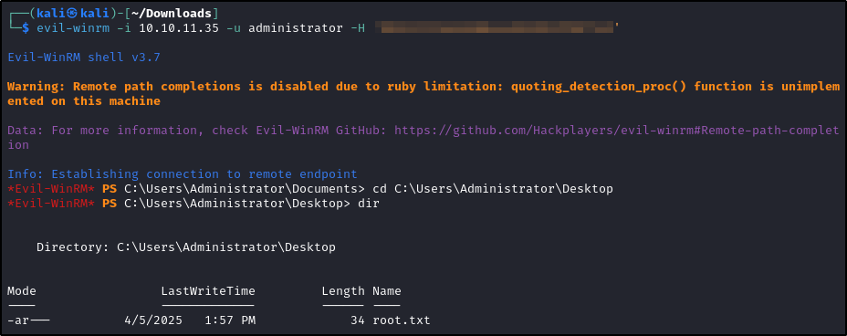
## Key Takeaways
- Enumeration of potential AD users is key
	- Additional Tools that could work are Kerbrute or Enum4Linux

---
*Flags redacted per HTB write-up guidelines. This write-up covers retired content only.*
