# Forest — Hack The Box

| Attribute | Details |
|---|---|
| Difficulty | Easy |
| OS | Windows |
| Status | Retired |
| Focus | Active Directory, AS-REP roasting, BloodHound, ACL abuse, DCSync |

## Overview

Forest demonstrates an Active Directory compromise beginning with domain user
enumeration and identification of a service account configured without Kerberos
preauthentication. AS-REP roasting exposes crackable authentication material for
the `svc-alfresco` account, providing initial access through WinRM. BloodHound
analysis then reveals an Active Directory permissions chain involving the
Account Operators and Exchange Windows Permissions groups. These permissions can
be abused to obtain `WriteDACL` over the domain, grant DCSync rights, and
recover the domain Administrator NTLM hash.

## Attack Path

`User Enumeration → AS-REP Roasting → Password Cracking → WinRM → BloodHound → ACL Abuse → WriteDACL → DCSync → Administrator` 

## Reconnaissance
- Nmap scan

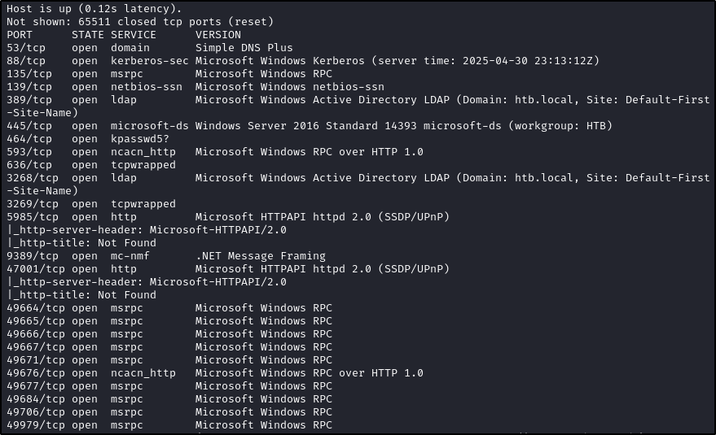
- Time skew present, so any Kerberos will need to update time to match domain controller

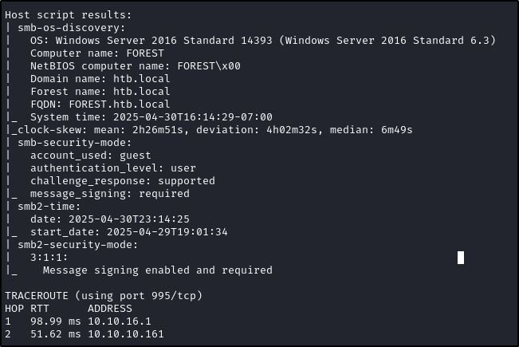

## Enumeration
- Starting with SMB

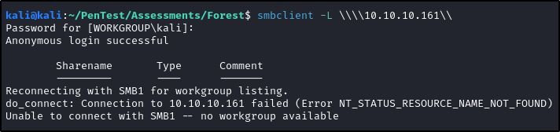
- Although anonymous connection is allowed, there are no shares to read

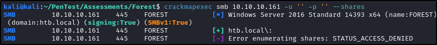
- Checking for users with crackmapexec (can also use NetExec) and locating potential user list

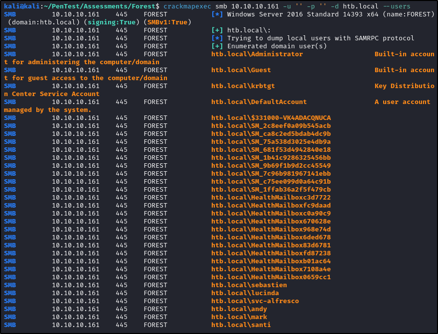

## Initial Foothold
- With a list of users, we can use several tools to proceed.

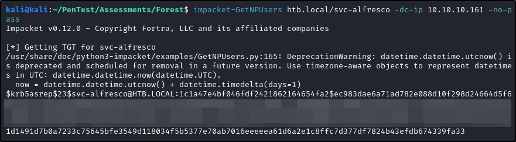
- With a list of candidate domain users, I tested for accounts that did not require Kerberos preauthentication `svc-alfresco` was configured without preauthentication, making the account vulnerable to AS-REP roasting.
- Using Impacket's `GetNPUsers.py`, I requested an AS-REP for the account and obtained material that could be cracked offline with Hashcat.

- Using hashcat to crack and get the plain text password

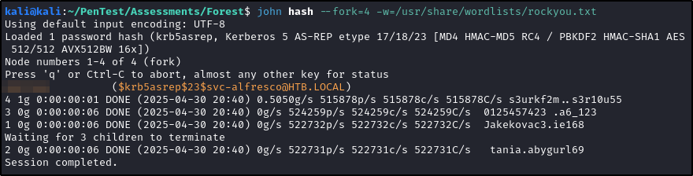
- User is able to remote access the box

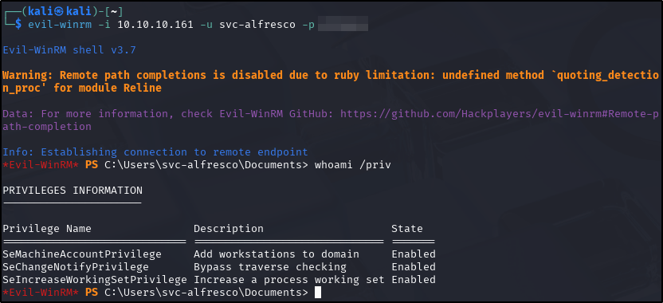

## Privilege Escalation
- Normal privilege escalation produced no results, so we run Bloodhound and locate an ACL chain that will get us to domain admin

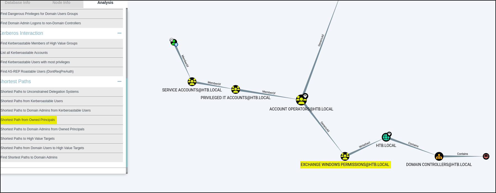
- First we create a new user

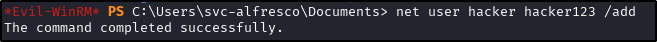
- Then we add our new user to the Exchange Windows Permissions group

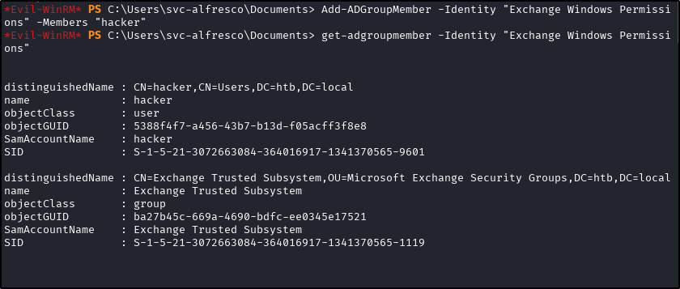
- From here, there are several options with WriteDacl, but the most straight forward is to use DCSync attack
- We first download PowerView.ps1 and setup are variables

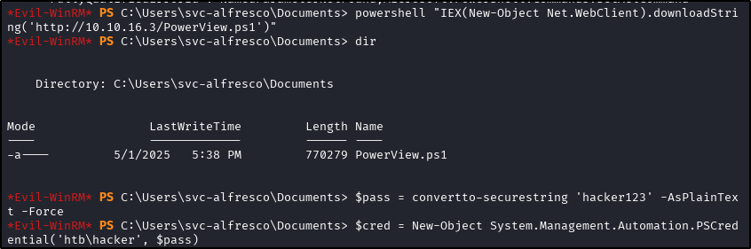
- Then we run the commands to grant DCSync access to our user we created

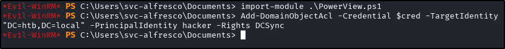
- Then we use Impacket's secretsdump tool to get the hash of the administrator

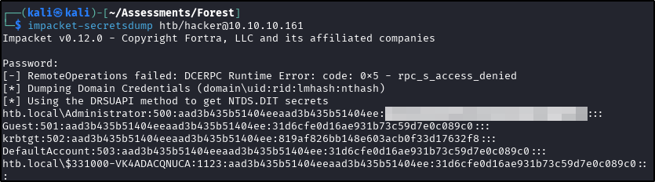
- With the hash obtained, we use Impacket's psexec tool to remote onto the box with system level access

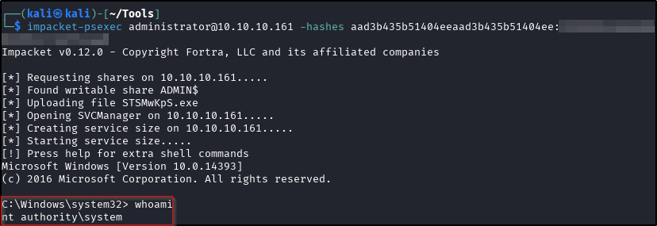

## Key Takeaways
- Active Directory knowledge is key as we do not start with any credentials
- CrackMapExec/NetExec along with Impacket are essential tools for windows machines
	- BloodyAD and Certipy could also be used in this situation

---
*Flags redacted per HTB write-up guidelines. This write-up covers retired content only.*
