# Resolute — Hack The Box

| Attribute  | Details                                                                                                      |
| ---------- | ------------------------------------------------------------------------------------------------------------ |
| Difficulty | Medium                                                                                                       |
| OS         | Windows                                                                                                      |
| Status     | Retired                                                                                                      |
| Focus      | Active Directory enumeration, credential exposure, password spraying, WinRM, PowerShell artifacts, DnsAdmins |

## Overview

Resolute demonstrates an Active Directory compromise beginning with anonymous RPC enumeration and credential exposure in domain user information. A leaked password can be sprayed against enumerated users, providing initial access as `melanie` through WinRM. Post-exploitation enumeration reveals credentials for `ryan` in a PowerShell artifact, and `ryan` is a member of the privileged `DnsAdmins` group. This membership can be abused to configure the DNS service to load an attacker-controlled DLL, resulting in command execution as `NT AUTHORITY\SYSTEM`.

## Attack Path

`Anonymous RPC → Credential Exposure → User Enumeration → Password Spray → WinRM as Melanie → PowerShell Credential Exposure → WinRM as Ryan → DnsAdmins → DNS Plugin DLL Abuse → SYSTEM`

## Reconnaissance

Initial enumeration identified a Windows host exposing services consistent with an Active Directory domain controller.

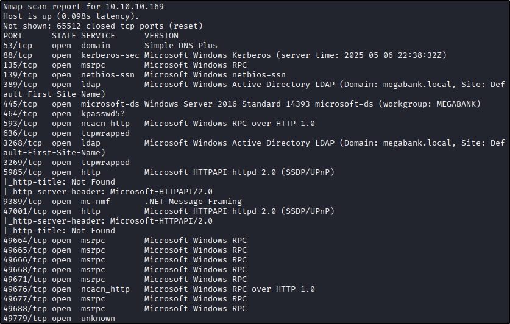

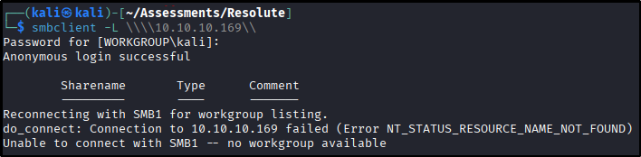

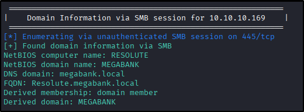

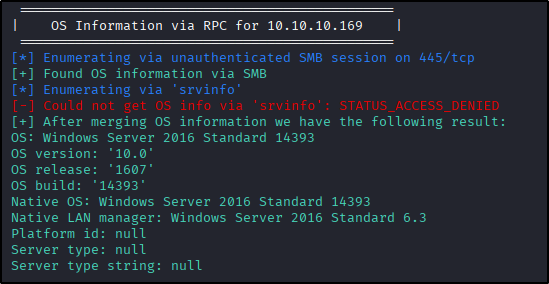

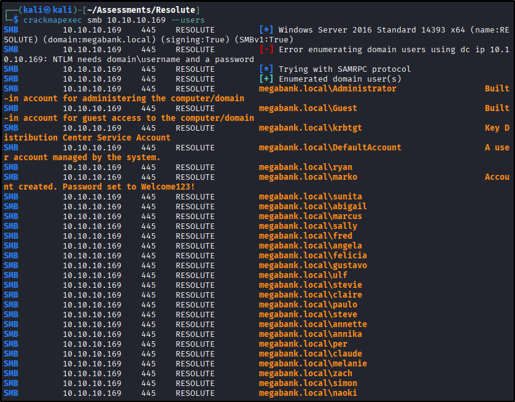

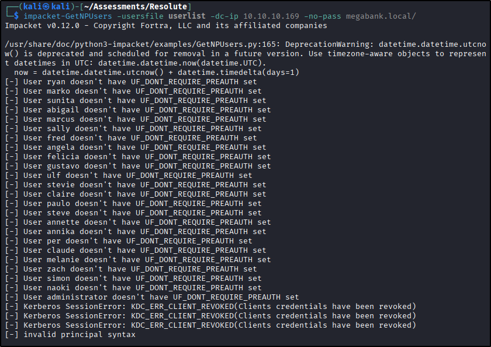

The exposed Active Directory services made unauthenticated domain enumeration the next logical step.

## Enumeration

An anonymous RPC connection was accepted by the domain controller, allowing domain information to be queried without valid credentials.

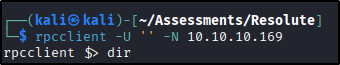

Domain enumeration exposed a password associated with one of the user accounts. The credential appeared to have been used as an initial or temporary password.

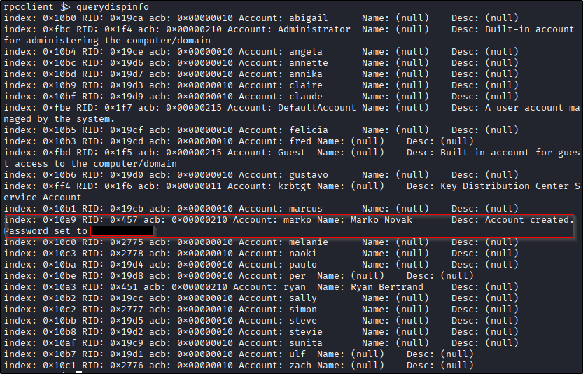

Although the password was no longer valid for the account where it was discovered, it represented a likely password-reuse opportunity. I sprayed the recovered password against the enumerated domain users.

The password was still valid for `melanie`.

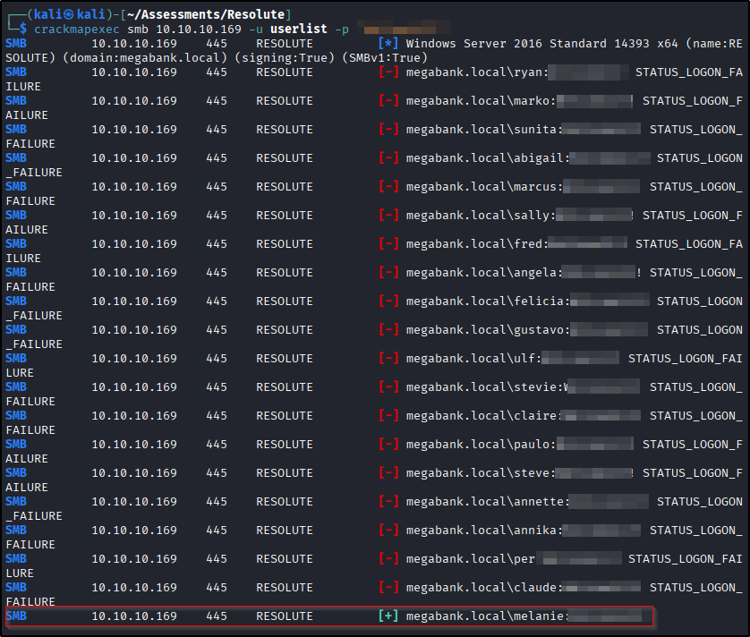

## Initial Access

The recovered credentials provided remote access through WinRM.

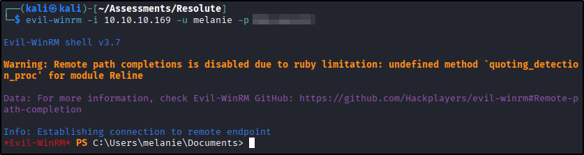

With an interactive session established, I began enumerating local users, groups, directories, and artifacts that could reveal another privilege boundary.

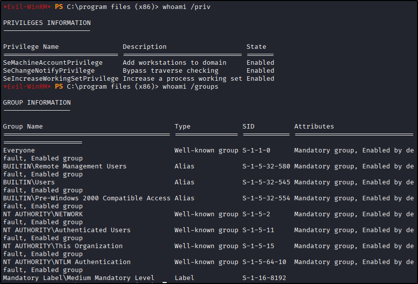

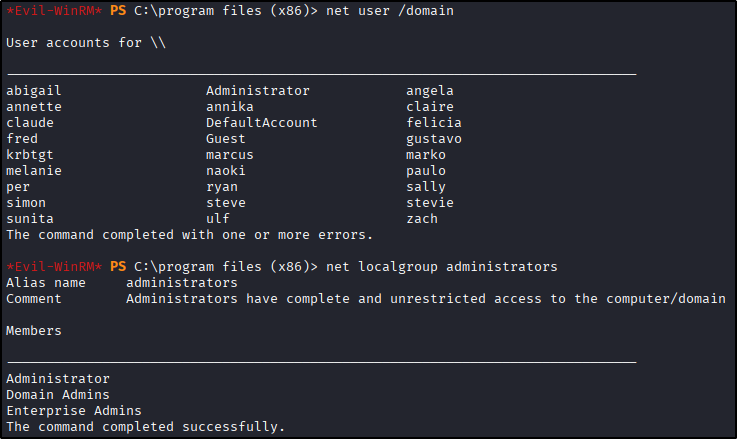

Filesystem enumeration revealed directories and files that were not obvious from the normal user profile.

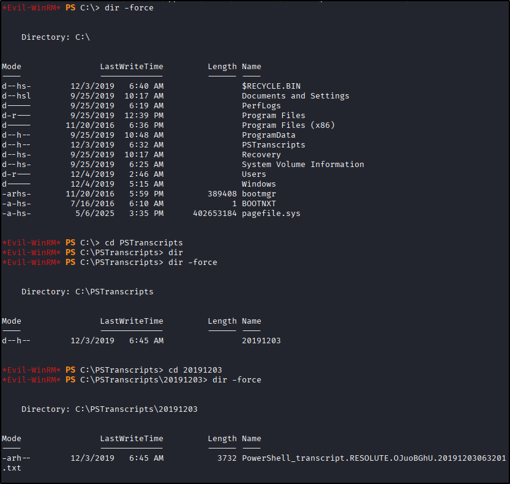

Further investigation located a PowerShell history/transcript artifact containing credentials for the `ryan` account.

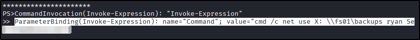

The recovered credentials were validated before attempting lateral movement.

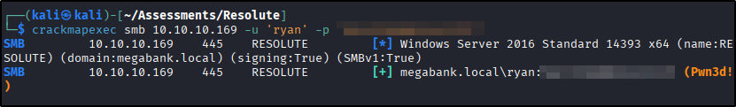

## Lateral Movement

The recovered credentials provided a second WinRM session, this time as `ryan`.

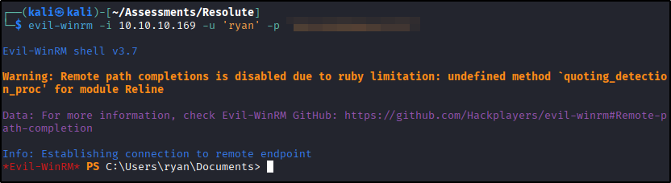

Group enumeration showed that `ryan` was a member of `DnsAdmins`.

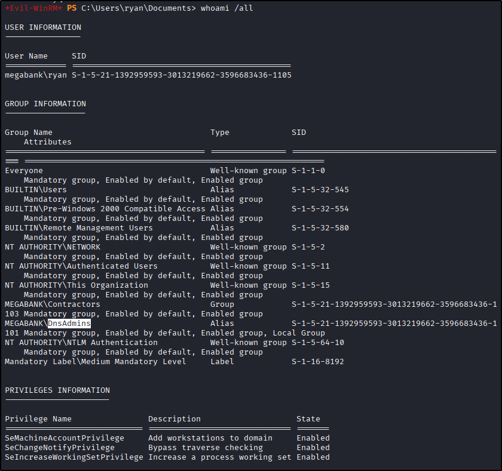

This was significantly more interesting than conventional local privilege escalation. Members of `DnsAdmins` can influence configuration of the Windows DNS Server service, creating a path to privileged code execution when DNS is running on the domain controller.

## Privilege Escalation

The DNS Server service supports loading a server-level plugin DLL. Because `ryan` could modify this configuration through his `DnsAdmins` membership, an attacker-controlled DLL could be configured as the DNS plugin.

I generated a DLL payload with `msfvenom` that would execute a privileged command when loaded by the DNS service.

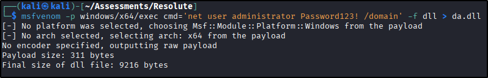

An SMB server was then used to make the DLL accessible to the target.

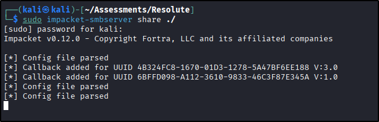

Using `dnscmd`, the DNS Server configuration was modified so that the server-level plugin DLL pointed to the attacker-controlled file.

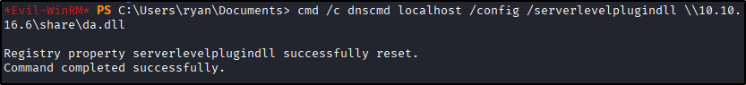

The remote share had to be accessible from the target before the DNS service attempted to load the DLL. After confirming access to the share, the DNS service was stopped and restarted.

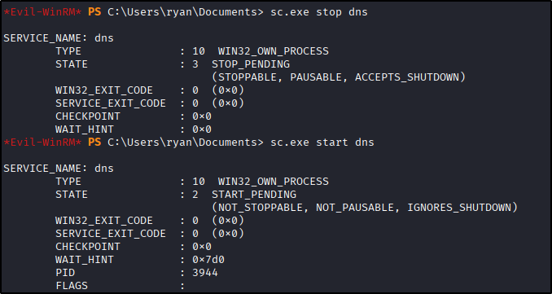

Because the DNS service executes with highly privileged permissions, loading the attacker-controlled DLL caused the configured command to execute with SYSTEM-level privileges.

The resulting Administrator access was confirmed using PsExec.

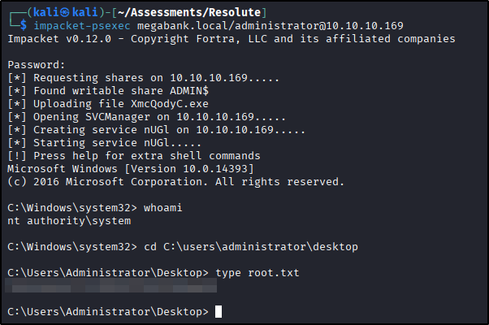

## Key Takeaways

* Anonymous Active Directory enumeration can expose information that becomes actionable when combined with credential reuse.
* Password spraying should be driven by evidence such as discovered default or temporary passwords rather than large blind password lists.
* Passwords should never be stored in Active Directory description fields, administrative scripts, PowerShell history, or transcript files.
* Credential reuse between domain accounts can turn an initial low-privilege foothold into lateral movement.
* Membership in groups such as `DnsAdmins` deserves close review because service-configuration privileges can translate into SYSTEM-level execution.
* Host enumeration should include PowerShell artifacts, hidden or unusual directories, group memberships, and service permissions rather than focusing exclusively on automated privilege-escalation tools.

## Tools Used

`Nmap` · `rpcclient` · `Evil-WinRM` · `msfvenom` · SMB server · `dnscmd` · PsExec

---

*Flags and credentials are redacted. This write-up covers retired content only.*
